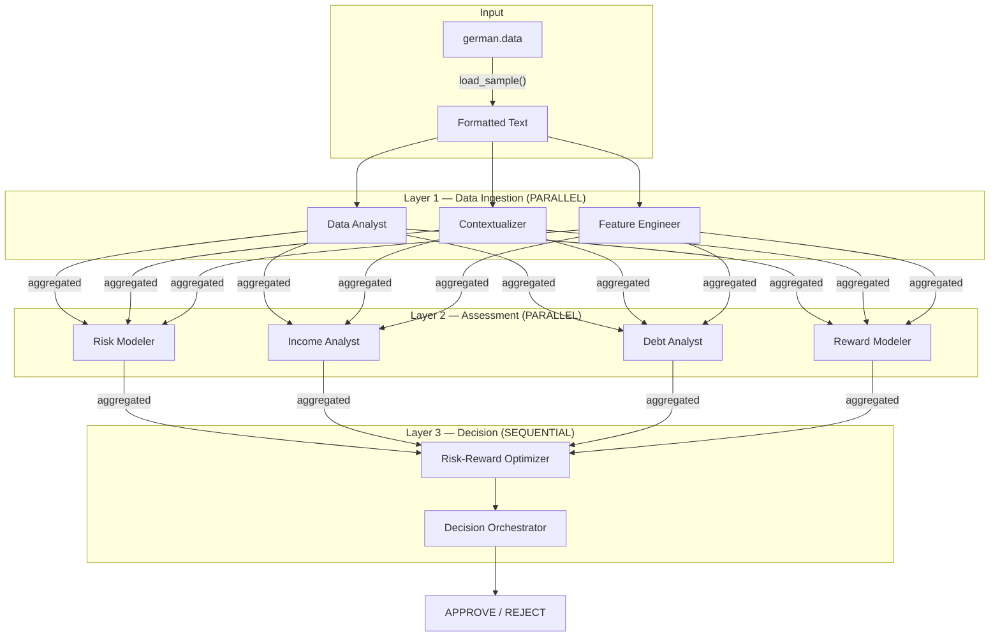

# MASCA - System Processing Documentation

## Tổng quan kiến trúc



---

## Bước 1: Đọc dữ liệu từ Dataset

### Vị trí code

| File | Hàm | Mô tả |
|---|---|---|
| `data/attribute_map.py` | `ATTRIBUTE_NAMES` | Danh sách 20 tên thuộc tính theo thứ tự |
| `data/attribute_map.py` | `CATEGORICAL_CODES` | Mapping mã → mô tả (A11 → "< 0 DM") |
| `data/loader.py` | `_parse_line(line)` | Parse 1 dòng space-delimited → dict |
| `data/loader.py` | `load_sample(index)` | Load sample theo index (0-999) |
| `data/loader.py` | `format_sample_for_agent(record)` | Format dict → text cho agent |

### Luồng xử lý

```
german.data (dòng thứ 11)
  "A12 12 A32 A40 1295 A61 A72 3 A92 A101 1 A123 25 A143 A151 1 A173 1 A191 A201 2"
      │
      ▼  _parse_line()
  {
    "checking_account_status": {"code": "A12", "description": "0 <= ... < 200 DM", "type": "categorical"},
    "duration_months": {"value": 12, "type": "numerical"},
    "credit_amount": {"value": 1295, "type": "numerical"},
    ...
    "credit_risk_label": {"value": 2, "label": "bad"}
  }
      │
      ▼  format_sample_for_agent()
  "=== Loan Application Data ===
   - Checking Account Status: A12 (0 <= ... < 200 DM)
   - Duration Months: 12
   - Credit Amount: 1295
   ..."
```

### Ví dụ thực tế (Sample #10)

**Input thô** (dòng 11 trong `german.data`):
```
A12 12 A32 A40 1295 A61 A72 3 A92 A101 1 A123 25 A143 A151 1 A173 1 A191 A201 2
```

**Output sau format:**
```
=== Loan Application Data ===

- Checking Account Status: A12 (0 <= ... < 200 DM)
- Duration Months: 12
- Credit History: A32 (existing credits paid back duly till now)
- Purpose: A40 (car (new))
- Credit Amount: 1295
- Savings Account: A61 (< 100 DM)
- Employment Since: A72 (< 1 year)
- Installment Rate: 3
- Personal Status Sex: A92 (female: divorced/separated/married)
- Other Debtors: A101 (none)
- Residence Since: 1
- Property: A123 (car or other (not in savings account))
- Age Years: 25
- Other Installment Plans: A143 (none)
- Housing: A151 (rent)
- Existing Credits: 1
- Job: A173 (skilled employee / official)
- Num Dependents: 1
- Telephone: A191 (none)
- Foreign Worker: A201 (yes)

[Ground Truth Label: bad]
```

---

## Bước 2: Khởi tạo Pipeline

### Vị trí code

| File | Hàm / Class | Mô tả |
|---|---|---|
| `main.py` | `main()` | Entry point, parse args, gọi orchestrator |
| `config/settings.py` | `get_llm_config()` | Đọc .env, tạo `LLMConfig` |
| `pipeline/orchestrator.py` | `MASCAOrchestrator.__init__()` | Khởi tạo 9 agents với config |
| `agents/base.py` | `BaseAgent.__init__()` | Tạo Gemini client |

### Luồng xử lý

```python
# main.py:108-109
llm_config = get_llm_config()       # Đọc GEMINI_API_KEY, model_name từ .env

# main.py:137-139
orchestrator = MASCAOrchestrator(config=llm_config, max_workers=4)
  │
  ├── self.data_analyst     = DataAnalystAgent(config)     # Layer 1
  ├── self.contextualizer   = ContextualizerAgent(config)
  ├── self.feature_engineer = FeatureEngineerAgent(config)
  ├── self.risk_modeler     = RiskModelerAgent(config)     # Layer 2
  ├── self.income_analyst   = IncomeAnalystAgent(config)
  ├── self.debt_analyst     = DebtAnalystAgent(config)
  ├── self.reward_modeler   = RewardModelerAgent(config)
  ├── self.risk_reward_optimizer  = RiskRewardOptimizerAgent(config)  # Layer 3
  └── self.decision_orchestrator  = DecisionOrchestratorAgent(config)
```

Mỗi agent kế thừa `BaseAgent`, trong `__init__` sẽ:
```python
# agents/base.py:25
self.client = genai.Client(api_key=config.api_key)
```

---

## Bước 3: Layer 1 — Data Ingestion & Contextualization (PARALLEL)

### Vị trí code

| File | Hàm | Mô tả |
|---|---|---|
| `pipeline/orchestrator.py` | `run()` dòng 108-116 | Gửi raw_input cho 3 agents |
| `pipeline/orchestrator.py` | `_run_parallel()` | Chạy song song bằng `ThreadPoolExecutor` |
| `agents/base.py` | `invoke(user_input)` | Gọi Gemini API, parse JSON |
| `prompts/templates.py` | `PROMPTS["data_analyst"]` | System prompt cho Data Analyst |
| `prompts/templates.py` | `PROMPTS["contextualizer"]` | System prompt cho Contextualizer |
| `prompts/templates.py` | `PROMPTS["feature_engineer"]` | System prompt cho Feature Engineer |

### Luồng xử lý

```
                    raw_input (formatted text)
                         │
          ┌──────────────┼──────────────┐
          ▼              ▼              ▼
   Data Analyst    Contextualizer   Feature Engineer
          │              │              │
          ▼              ▼              ▼
   structured_data   persona_report   derived_features
```

Ba agents chạy **song song** qua `ThreadPoolExecutor`:
```python
# pipeline/orchestrator.py:70-86
with ThreadPoolExecutor(max_workers=self.max_workers) as executor:
    for agent, input_text in agents_with_inputs:
        future = executor.submit(agent.invoke, input_text)
```

Mỗi `agent.invoke()` gọi Gemini:
```python
# agents/base.py:49-62
response = self.client.models.generate_content(
    model=self.config.model_name,                # "gemini-2.5-flash-lite"
    contents=user_input,                          # ← Dữ liệu ứng viên
    config=types.GenerateContentConfig(
        system_instruction=self.system_prompt,    # ← Vai trò agent (từ prompts/)
        temperature=0.3,
        response_mime_type="application/json",    # Bắt buộc JSON output
    ),
)
```

### Ví dụ output (Sample #10)

**Data Analyst** → Chuẩn hóa 20 attributes:
```json
{
  "structured_data": [
    {"attribute": "X1", "name": "Status of existing checking account", "value": "A12", "description": "0 <= ... < 200 DM"},
    {"attribute": "X2", "name": "Duration Months", "value": "12 Months", "description": null},
    ...
  ]
}
```

**Contextualizer** → Persona ứng viên:
```json
{
  "output_requirements": {
    "persona_report": "This applicant is a 25-year-old female, foreign worker, rents housing, employed < 1 year as skilled employee. Low checking (0-199 DM) and savings (< 100 DM). Positive credit history...",
    "context_confidence_score": 0.95
  }
}
```

**Feature Engineer** → Tính toán metrics:
```json
{
  "derived_features": [
    {"feature_name": "Employment Stability Index", "value": "0.02 (0.5 years / 25 years)"},
    {"feature_name": "DTI", "value": "Cannot be calculated - requires income data"},
    ...
  ]
}
```

---

## Bước 4: Layer 2 — Multidimensional Assessment (PARALLEL)

### Vị trí code

| File | Hàm | Mô tả |
|---|---|---|
| `pipeline/orchestrator.py` | `run()` dòng 118-143 | Aggregate L1, gửi cho 4 agents |
| `agents/layer2/risk_modeler.py` | `RiskModelerAgent` | Phân tích rủi ro |
| `agents/layer2/income_analyst.py` | `IncomeAnalystAgent` | Đánh giá thu nhập |
| `agents/layer2/debt_analyst.py` | `DebtAnalystAgent` | Phân tích nợ |
| `agents/layer2/reward_modeler.py` | `RewardModelerAgent` | Đánh giá lợi nhuận |

### Luồng xử lý

**Input cho Layer 2** = Aggregate tất cả output Layer 1 + raw data gốc:
```python
# pipeline/orchestrator.py:119-128
layer1_summary = (
    "=== Aggregated Layer 1 Results ===\n\n"
    f"--- Data Analyst Output ---\n{json.dumps(layer1_results['Data Analyst'])}\n\n"
    f"--- Contextualizer Output ---\n{json.dumps(layer1_results['Contextualizer'])}\n\n"
    f"--- Feature Engineer Output ---\n{json.dumps(layer1_results['Feature Engineer'])}\n\n"
    f"--- Original Application Data ---\n{raw_input}"
)
```

```
              Layer 1 aggregated output
                      │
       ┌──────────────┼──────────────┬──────────────┐
       ▼              ▼              ▼              ▼
  Risk Modeler   Income Analyst  Debt Analyst   Reward Modeler
       │              │              │              │
       ▼              ▼              ▼              ▼
  risk_score     stability_score feasibility    reward_score
    0.65             0.35           0.35           0.60
```

### Ví dụ output (Sample #10)

| Agent | Score | Phân tích chính |
|---|---|---|
| Risk Modeler | **0.65** | Low liquid assets, short employment, foreign worker |
| Income Analyst | **0.35** | Employment < 1 year, low savings buffer |
| Debt Analyst | **0.35** | Loan 1295 DM/12 months, no income data to verify |
| Reward Modeler | **0.60** | Positive credit history, moderate profit potential |

---

## Bước 5: Layer 3 — Strategic Optimization (SEQUENTIAL)

### Vị trí code

| File | Hàm | Mô tả |
|---|---|---|
| `pipeline/orchestrator.py` | `run()` dòng 145-186 | Chạy tuần tự 2 agents |
| `agents/layer3/risk_reward_optimizer.py` | `RiskRewardOptimizerAgent` | Tối ưu risk/reward |
| `agents/layer3/decision_orchestrator.py` | `DecisionOrchestratorAgent` | Quyết định cuối |

### Luồng xử lý

**Bước 5a — Risk-Reward Optimizer** (nhận output Layer 2):
```python
# pipeline/orchestrator.py:153-166
layer2_summary = "=== Layer 2 Assessment Results ===\n" + ...
optimizer_result = self.risk_reward_optimizer.invoke(layer2_summary)
```

**Bước 5b — Decision Orchestrator** (nhận TẤT CẢ: raw + L1 + L2 + optimizer):
```python
# pipeline/orchestrator.py:173-182
final_input = (
    "=== Complete Assessment Summary ===\n"
    f"--- Original Application ---\n{raw_input}\n"
    f"--- Layer 1 Results ---\n{json.dumps(layer1_results)}\n"
    f"--- Layer 2 Results ---\n{json.dumps(layer2_results)}\n"
    f"--- Risk-Reward Optimization ---\n{json.dumps(optimizer_result)}"
)
decision_result = self.decision_orchestrator.invoke(final_input)
```

```
  Risk Modeler ──┐
  Income Analyst ┤
  Debt Analyst ──┤──► Risk-Reward Optimizer ──► Decision Orchestrator
  Reward Modeler ┘          │                          │
                     risk_reward_ratio            APPROVE/REJECT
                          0.50                    + confidence
                                                  + justification
```

### Ví dụ output (Sample #10)

**Risk-Reward Optimizer:**
```json
{
  "risk_reward_ratio": 0.50,
  "risk_assessment": "Low liquid assets, short employment, foreign worker...",
  "final_recommendation": "Approve with conditions — verify income stability"
}
```

**Decision Orchestrator (quyết định cuối cùng):**
```json
{
  "decision": "REJECT",
  "confidence": 0.75,
  "justification": "Significant risk factors outweigh potential reward. Low liquid assets, short employment tenure, lack of verifiable income...",
  "key_factors": [
    "Low liquid assets",
    "Short employment tenure (< 1 year)",
    "Foreign worker status",
    "Lack of verifiable income details",
    "Limited financial buffer"
  ]
}
```

> **Lưu ý:** Risk-Reward Optimizer đề xuất "Approve with conditions" nhưng Decision Orchestrator quyết định REJECT — cho thấy L3 hoạt động đúng kiến trúc hierarchical, Decision Orchestrator có thể **override** các đề xuất trước đó.

---

## Bước 6: Trả kết quả

### Vị trí code

| File | Hàm | Mô tả |
|---|---|---|
| `main.py` | `print_result_summary(results)` | In kết quả formatted |
| `evaluate.py` | `map_decision_to_label(decision)` | APPROVE→good, REJECT→bad |
| `evaluate.py` | `compute_statistics(results)` | Accuracy, Precision, Recall, F1 |
| `evaluate.py` | `save_checkpoint(...)` | Lưu checkpoint sau mỗi sample |

### Output cuối cùng

```
======================================================================
  MASCA CREDIT ASSESSMENT RESULTS
======================================================================

📋 Decision: REJECT
📊 Confidence: 0.75
📝 Justification: The applicant presents a combination of significant
   risk factors that outweigh the potential reward...

🔑 Key Factors:
   • Low liquid assets (checking and savings accounts)
   • Short employment tenure (< 1 year)
   • Foreign worker status

📈 Assessment Scores:
   • Risk Score: 0.65
   • Income Stability: 0.35
   • Loan Feasibility: 0.35
   • Reward Score: 0.6
   • Risk-Reward Ratio: 0.5

⏱️  Total Pipeline Time: 10.96s
======================================================================
```

So sánh: **Ground Truth = bad** → **Decision = REJECT** → ✅ **Đúng!**

---

## Tổng hợp: Toàn bộ flow cho 1 sample

```
main.py:main()
  │
  ├── config/settings.py:get_llm_config()           # Load .env
  ├── data/loader.py:load_sample(10)                 # Parse german.data dòng 11
  ├── data/loader.py:format_sample_for_agent()       # Text format cho LLM
  │
  └── pipeline/orchestrator.py:MASCAOrchestrator.run(raw_input)
        │
        ├── _run_parallel(Layer 1)                   # ThreadPoolExecutor
        │     ├── DataAnalystAgent.invoke()           # → structured_data
        │     ├── ContextualizerAgent.invoke()        # → persona_report
        │     └── FeatureEngineerAgent.invoke()       # → derived_features
        │
        ├── aggregate Layer 1 outputs                # JSON concat
        │
        ├── _run_parallel(Layer 2)                   # ThreadPoolExecutor
        │     ├── RiskModelerAgent.invoke()           # → risk_score: 0.65
        │     ├── IncomeAnalystAgent.invoke()         # → stability: 0.35
        │     ├── DebtAnalystAgent.invoke()           # → feasibility: 0.35
        │     └── RewardModelerAgent.invoke()         # → reward: 0.60
        │
        ├── aggregate Layer 2 outputs                # JSON concat
        │
        ├── RiskRewardOptimizerAgent.invoke()        # → ratio: 0.50
        │
        ├── aggregate ALL outputs
        │
        └── DecisionOrchestratorAgent.invoke()       # → REJECT (0.75)
              │
              └── return all_results                 # Dict chứa tất cả output
```

**Tổng: 9 lần gọi Gemini API / sample, ~11 giây / sample**
