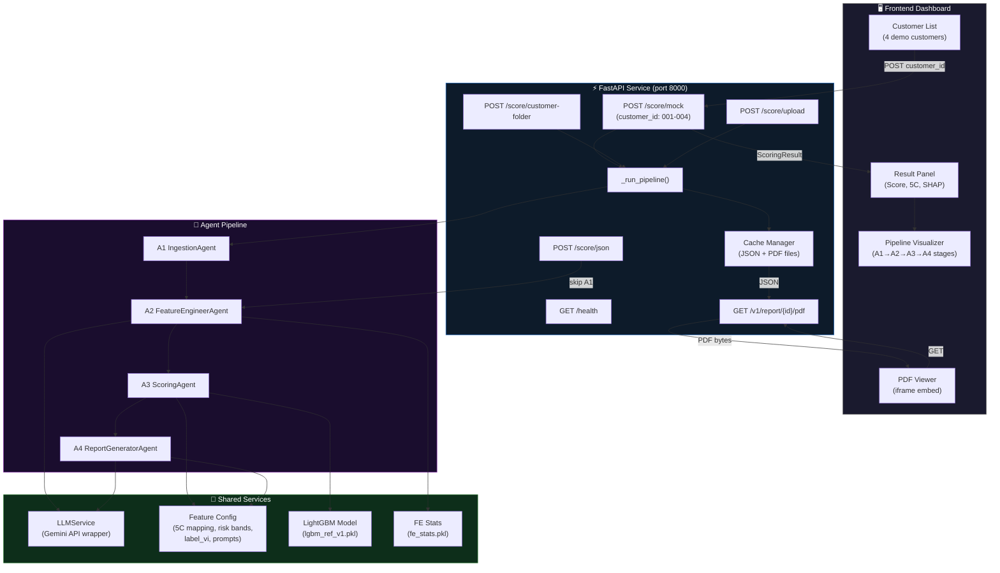
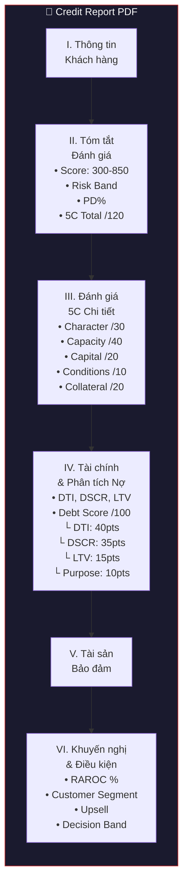
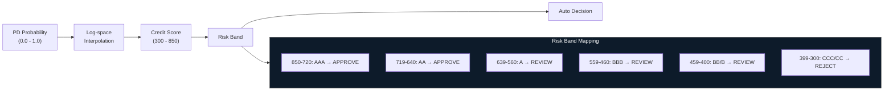
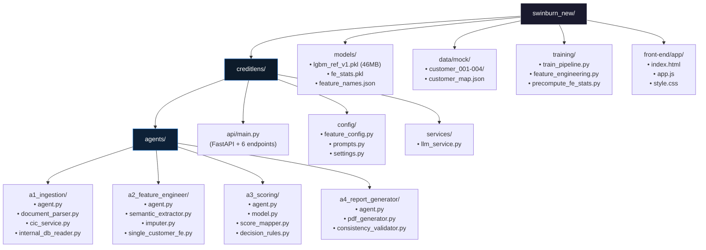

# CreditLens AI — System Architecture

## 1. High-Level Pipeline

```mermaid
flowchart LR
    subgraph INPUT["📁 Customer Data Folder"]
        PDF["01-05 PDFs\n(CCCD, HĐLĐ, Hộ khẩu,\nThẩm định, Đơn vay)"]
        CIC["07 CIC API\n(Bureau + EXT_SOURCE)"]
        IDB["08 Internal DB\n(Prev loans, POS,\nInstallments, CC)"]
        ARJ["application_row.json\n(Fast-path: 122 cols)"]
    end

    subgraph A1["🔵 A1 — Data Ingestion"]
        A1_DOC["Document Parser\n(PyMuPDF OCR)"]
        A1_CIC["CIC Service\n(Mock JSON)"]
        A1_IDB["Internal DB Reader\n(JSON → DataFrames)"]
        A1_FAST["Fast-Path Loader\n(JSON → 122 cols)"]
    end

    subgraph A2["🟢 A2 — Feature Engineer"]
        A2_SEM["Semantic Extractor\n(Gemini LLM)"]
        A2_IMP["Intelligent Imputer"]
        A2_FE["SingleCustomerFE\n(218 raw → 753 features)"]
        A2_FALL["Loan Purpose Fallback\n(Contract → Category)"]
    end

    subgraph A3["🟠 A3 — ML Scoring"]
        A3_LGB["LightGBM Predict\n(predict_proba → PD)"]
        A3_MAP["Score Mapper\n(PD% → 300-850)"]
        A3_SHAP["SHAP TreeExplainer\n(Top ±10 factors)"]
        A3_DEC["Decision Rules\n(Hard overrides)"]
    end

    subgraph A4["🔴 A4 — Report Generator"]
        A4_FIN["Financial Ratios\n(DTI, DSCR, LTV)"]
        A4_5C["5C Narrative\n(Gemini / Mock)"]
        A4_DEBT["Debt Analyst\n(100pts scoring)"]
        A4_REW["Reward Modeler\n(RAROC, Segments)"]
        A4_CON["Consistency Validator"]
        A4_PDF["PDF Generator\n(ReportLab 6-section)"]
    end

    PDF --> A1_DOC
    CIC --> A1_CIC
    IDB --> A1_IDB
    ARJ --> A1_FAST

    A1_DOC --> A1_OUT["a1_output"]
    A1_CIC --> A1_OUT
    A1_IDB --> A1_OUT
    A1_FAST -.->|"skip OCR"| A1_OUT

    A1_OUT --> A2_SEM
    A1_OUT --> A2_FE
    A2_SEM --> A2_FALL
    A2_FE --> A2_OUT["a2_output\n(753 features + llm_feats)"]
    A2_FALL --> A2_OUT
    A2_IMP --> A2_OUT

    A2_OUT --> A3_LGB
    A3_LGB --> A3_MAP --> A3_SHAP --> A3_DEC
    A3_DEC --> A3_OUT["a3_output\n(score, PD, SHAP, band)"]

    A3_OUT --> A4_5C
    A3_OUT --> A4_FIN
    A3_OUT --> A4_DEBT
    A3_OUT --> A4_REW
    A1_OUT -.->|"app_row"| A4_FIN
    A1_OUT -.->|"app_row"| A4_DEBT
    A2_OUT -.->|"llm_feats"| A4_5C

    A4_5C --> A4_CON --> A4_PDF
    A4_FIN --> A4_PDF
    A4_DEBT --> A4_PDF
    A4_REW --> A4_PDF
    A4_PDF --> REPORT["📄 credit_report.pdf\n+ credit_report.json"]

    style INPUT fill:#1a1a2e,stroke:#444,color:#fff
    style A1 fill:#0d2137,stroke:#1565c0,color:#fff
    style A2 fill:#0d2e1a,stroke:#2e7d32,color:#fff
    style A3 fill:#2e1f0d,stroke:#e65100,color:#fff
    style A4 fill:#2e0d0d,stroke:#c62828,color:#fff
```

---

## 2. API & Frontend Architecture

---

## 3. Data Flow — Chi tiết I/O từng Agent

```mermaid
flowchart TD
    subgraph A1_IO["A1 Input/Output"]
        A1_IN["📥 INPUT\n• customer_dir (Path)\n• 01-05 PDFs\n• 07_cic_api.json\n• 08_internal_db.json\n• application_row.json"]
        A1_PROC["⚙️ PROCESS\n1. Fast-path check → JSON load\n2. PDF OCR → regex parse\n3. CIC JSON → EXT_SOURCE + bureau\n4. Internal DB → 4 DataFrames\n5. Cross-doc identity check"]
        A1_OPUT["📤 OUTPUT\n• application_row: dict (122 cols)\n• bureau_df: DataFrame\n• bureau_balance_df: DataFrame\n• previous_application_df: DataFrame\n• pos_cash_df: DataFrame\n• installments_df: DataFrame\n• credit_card_df: DataFrame\n• thin_file_flag: bool\n• raw_texts: dict\n• identity_consistency_flag: str"]
        A1_IN --> A1_PROC --> A1_OPUT
    end

    subgraph A2_IO["A2 Input/Output"]
        A2_IN["📥 INPUT\n• a1_output (dict)"]
        A2_PROC["⚙️ PROCESS\n1. Semantic extraction (Gemini)\n   → loan_purpose, risk_flags\n2. Fallback: NAME_CONTRACT_TYPE\n   → loan_purpose if UNCLEAR\n3. SingleCustomerFE:\n   218 raw → 753 ML features\n4. Imputation metadata"]
        A2_OPUT["📤 OUTPUT\n• feature_vector: Series (753)\n• llm_feats: dict\n  └ loan_purpose_category\n  └ positive_signals\n  └ risk_flags\n  └ income_stability_index\n  └ thin_file_flag\n• imputation_log: list\n• application_row: dict (pass-through)"]
        A2_IN --> A2_PROC --> A2_OPUT
    end

    subgraph A3_IO["A3 Input/Output"]
        A3_IN["📥 INPUT\n• a2_output (dict)"]
        A3_PROC["⚙️ PROCESS\n1. Align 753 features → model.feature_names\n2. LightGBM predict_proba → PD (0-1)\n3. PD → Credit Score (300-850)\n   log-space piecewise linear\n4. SHAP TreeExplainer → attributions\n5. 5C SHAP allocation\n6. Hard override decision rules"]
        A3_OPUT["📤 OUTPUT\n• credit_score: int (300-850)\n• pd_pct: float (%)\n• risk_band: AAA|AA|A|BBB|BB|B|CCC|CC\n• shap_values: dict\n  └ top_positive_factors (10)\n  └ top_negative_factors (10)\n  └ five_c_shap_allocation\n• routing: APPROVE|REVIEW|REJECT\n• features_df: DataFrame"]
        A3_IN --> A3_PROC --> A3_OPUT
    end

    subgraph A4_IO["A4 Input/Output"]
        A4_IN["📥 INPUT\n• a3_output (score, SHAP, PD)\n• a2_output (llm_feats, warnings)\n• a1_output (application_row)"]
        A4_PROC["⚙️ PROCESS\n1. Financial Ratios from app_row\n   DTI = annuity_mo / income_mo\n   DSCR = income_mo / annuity_mo\n   LTV = credit / goods_price\n2. LLM 5C Narrative (Gemini/Mock)\n3. Debt Analyst (100pts deterministic)\n4. Reward Modeler (RAROC)\n5. Consistency validation\n6. PDF rendering (6 sections)"]
        A4_OPUT["📤 OUTPUT\n• final_report: dict (6 sections)\n  └ I.  customer_info\n  └ II. executive_summary\n  └ III. five_c_scorecard\n  └ IV.  financial + debt_assessment\n  └ V.   collateral_detail\n  └ VI.  reward_assessment + terms\n• five_c_scores: dict (/120)\n• consistency_check: dict"]
        A4_IN --> A4_PROC --> A4_OPUT
    end

    A1_OPUT --> A2_IN
    A2_OPUT --> A3_IN
    A3_OPUT --> A4_IN
    A1_OPUT -.->|"app_row for ratios"| A4_IN
    A2_OPUT -.->|"llm_feats"| A4_IN

    style A1_IO fill:#0d2137,stroke:#1565c0,color:#fff
    style A2_IO fill:#0d2e1a,stroke:#2e7d32,color:#fff
    style A3_IO fill:#2e1f0d,stroke:#e65100,color:#fff
    style A4_IO fill:#2e0d0d,stroke:#c62828,color:#fff
```

---

## 4. A4 Report — PDF Sections

---

## 5. Scoring Pipeline — PD → Credit Score → Risk Band

---

## 6. File Structure Map

---

## 7. LLM Usage Points

| Component | Khi nào dùng LLM | Model | Fallback |
|---|---|---|---|
| A2 `SemanticExtractor` | Extract loan_purpose, risk_flags từ OCR text | Gemini Flash | Return UNCLEAR → fallback từ NAME_CONTRACT_TYPE |
| A2 `IntelligentImputer` | Impute missing fields (disabled in mock) | Gemini Flash | Skip imputation |
| A4 `_generate_narrative` | Viết 5C assessment narrative tiếng Việt | Gemini Flash | Deterministic scoring dựa trên credit_score |
| A4 `_compute_debt_assessment` | ❌ **Không dùng LLM** | — | 100% deterministic |
| A4 `_compute_reward_assessment` | ❌ **Không dùng LLM** | — | 100% deterministic |
