# SOFTWARE DESIGN DOCUMENT
## CreditLens AI — Credit Scoring & Creditworthiness Assessment

**Version:** 1.1  
**Date:** 2026-03-20  
**Project:** CreditLens AI — Giải bài toán underbanked & micro SME bằng ML + LLM Explainability  
**Dataset:** Home Credit Default Risk (307,511 records, 8 tables)  
**Core Stack:** LightGBM + SHAP + Claude + LangGraph + AWS Bedrock  

---

## Mục lục

1. [Giới thiệu & Phạm vi](#1-giới-thiệu--phạm-vi)
2. [Kiến trúc hệ thống tổng quan](#2-kiến-trúc-hệ-thống-tổng-quan)
3. [Data Flow & Processing Pipeline](#3-data-flow--processing-pipeline)
4. [Chi tiết Agent A1 — Data Ingestion](#4-chi-tiết-agent-a1--data-ingestion)
5. [Chi tiết Agent A2 — LLM Feature Engineer](#5-chi-tiết-agent-a2--llm-feature-engineer)
6. [Chi tiết Agent A3 — ML Scoring Engine](#6-chi-tiết-agent-a3--ml-scoring-engine)
7. [Chi tiết Agent A4 — Report Generator](#7-chi-tiết-agent-a4--report-generator)
8. [Home Credit Dataset — Schema & Mapping](#8-home-credit-dataset--schema--mapping)
9. [Sequence Diagrams — Luồng xử lý End-to-End](#9-sequence-diagrams--luồng-xử-lý-end-to-end)
10. [Ví dụ xử lý thực tế](#10-ví-dụ-xử-lý-thực-tế)
11. [ERD — Entity Relationship Diagram](#11-erd--entity-relationship-diagram)
12. [Deployment Architecture](#12-deployment-architecture)
13. [Chiến lược đánh giá & KPI](#13-chiến-lược-đánh-giá--kpi)
14. [Phụ lục](#14-phụ-lục)

---

## 1. Giới thiệu & Phạm vi

### 1.1 Problem Statement

Hệ thống tín dụng truyền thống tại Việt Nam gặp **3 điểm đau chính**:

| # | Pain Point | Root Cause | Giải pháp CreditLens |
|---|-----------|------------|----------------------|
| P1 | **Thin-file exclusion** — ~70% dân số VN không đủ lịch sử CIC | Scoring chỉ dùng credit bureau | **Alternative Data Pipeline**: transaction behavioral features từ sao kê thay thế CIC |
| P2 | **Static rules** không thích nghi | Scorecard cứng, không xử lý unstructured docs | **LLM Feature Engineering**: semantic features từ văn bản phi cấu trúc |
| P3 | **Black-box**, không giải thích | AI scoring không trace được decision | **Grounded XAI Stack**: SHAP → LLM narrative → audit trail bất biến |

### 1.2 Phạm vi tài liệu

Tài liệu này mô tả thiết kế phần mềm chi tiết cho hệ thống CreditLens AI, bao gồm:
- Kiến trúc 4-agent orchestration qua LangGraph
- Data pipeline từ raw documents đến credit report
- Feature engineering mapping giữa Home Credit dataset và production
- Sequence diagrams cho mọi luồng xử lý
- Ví dụ xử lý cụ thể cho từng agent
- Deployment architecture trên AWS

### 1.3 Tại sao Home Credit Default Risk?

- **Đúng population**: Home Credit Việt Nam phục vụ chính xác underbanked population
- **307,511 records**: đủ lớn để train LightGBM ổn định
- **8 bảng quan hệ**: bao gồm bureau data, installments, POS cash, credit card
- **Default rate 8%**: class imbalance thực tế — cần ADASYN
- **Kaggle top AUC ~0.794**: baseline cộng đồng benchmark rõ ràng

---

## 2. Kiến trúc hệ thống tổng quan

### 2.1 High-Level Architecture Diagram

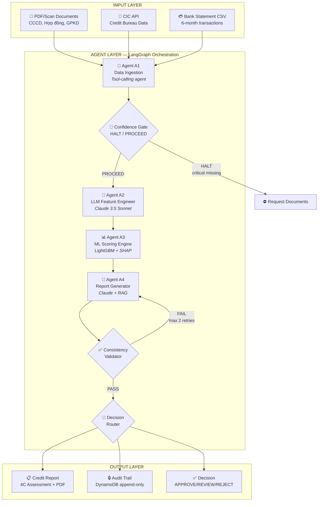

### 2.2 Nguyên tắc thiết kế cốt lõi

> **"ML làm scoring (A3) — không bao giờ để LLM làm. LLM làm 2 việc: (1) trích xuất features từ text (A2), và (2) diễn giải SHAP thành narrative (A4)."**

| Nguyên tắc | Mô tả |
|-----------|-------|
| **Separation of Concerns** | Mỗi agent làm đúng 1 việc — không agent nào làm thay agent khác |
| **Deterministic Scoring** | A3 là deterministic — same input luôn cho same output |
| **Grounded Explainability** | LLM narrative phải grounded trên SHAP — không tự suy luận |
| **Immutable Audit** | Mọi action được ghi vào append-only log, không thể modify |
| **Thin-file First** | Không từ chối underbanked — activate alternative scoring path |

### 2.3 LangGraph State Schema

```python
class CreditState(TypedDict):
    # ── Core identifiers ──
    application_id:     str                    # SHA-256(applicant_id + timestamp)
    customer_type:      Literal["INDIVIDUAL", "SME"]

    # ── A1 outputs ──
    raw_ocr_text:       dict[str, str]         # {doc_type: extracted_text}
    structured_feats:   dict[str, Any]         # {feature_name: value}
    confidence_map:     dict[str, float]       # {feature_name: confidence_0_to_1}
    missing_fields:     list[str]              # critical/important fields below threshold

    # ── A2 outputs ──
    llm_feats:          dict[str, Any]         # semantic features + imputed values
    imputation_log:     list[dict]             # [{field, method, confidence, source}]
    warnings:           list[str]              # human-readable warning messages
    overall_confidence: float                  # weighted mean across all fields

    # ── A3 outputs ──
    credit_score:       int                    # 300–850
    pd_pct:             float                  # probability of default %
    risk_band:          str                    # AAA/AA/A/BBB/CC
    shap_values:        dict                   # full SHAP JSON

    # ── A4 outputs ──
    four_c_scores:      dict[str, float]       # {character, capacity, capital, conditions}
    narrative:          dict[str, str]         # LLM text per 4C dimension
    consistency_check:  dict                   # narrative vs SHAP validation result
    final_report:       dict                   # complete structured report

    # ── Routing & audit ──
    routing:            str                    # AUTO_APPROVE|REVIEW|REJECT|ESCALATE|HALT
    audit_trail:        list[dict]             # immutable append-only log
```

---

## 3. Data Flow & Processing Pipeline

### 3.1 LangGraph Node Graph

```mermaid
graph LR
    START(("▶ START")) --> INGEST["ingest_documents<br/><i>Tool-calling</i>"]
    INGEST --> CIC_CHECK["check_cic<br/><i>API call</i>"]
    INGEST --> TX_ANALYZE["analyze_transactions<br/><i>Code executor</i>"]
    CIC_CHECK --> CONF_GATE{"confidence_gate<br/><i>Conditional router</i>"}
    TX_ANALYZE --> CONF_GATE
    CONF_GATE -->|"critical missing → HALT"| HALT_NODE["⛔ HALT<br/>Request docs"]
    CONF_GATE -->|"PROCEED"| LLM_FE["llm_feature_engineer<br/><i>Claude LLM</i>"]
    LLM_FE --> ML_SCORE["ml_score<br/><i>SageMaker API</i>"]
    ML_SCORE --> REPORT_GEN["report_generator<br/><i>Claude LLM</i>"]
    REPORT_GEN --> CONSIST_VAL["consistency_validator<br/><i>Deterministic code</i>"]
    CONSIST_VAL -->|"PASS"| DECISION["decision_router<br/><i>Policy rules</i>"]
    CONSIST_VAL -->|"FAIL (max 2 retries)"| REPORT_GEN
    DECISION --> END_NODE(("⏹ END"))
```

### 3.2 Node Routing Table

| Node | Type | Entry Condition | Exit → Next |
|------|------|----------------|-------------|
| `ingest_documents` | Tool-calling | START | → `check_cic` (parallel) + `analyze_transactions` (parallel) |
| `check_cic` | API call | After ingest | → `confidence_gate` (join) |
| `analyze_transactions` | Code executor | After ingest | → `confidence_gate` (join) |
| `confidence_gate` | Conditional router | After CIC + transactions done | HALT if critical missing; PROCEED otherwise |
| `llm_feature_engineer` | LLM (Claude) | routing == PROCEED | → `ml_score` |
| `ml_score` | SageMaker API | After LLM FE | → `report_generator` |
| `report_generator` | LLM (Claude) | After ML score | → `consistency_validator` |
| `consistency_validator` | Deterministic | After report | → `decision_router` |
| `decision_router` | Policy rules | After consistency check | → END (with routing label) |

### 3.3 Confidence Gate Logic

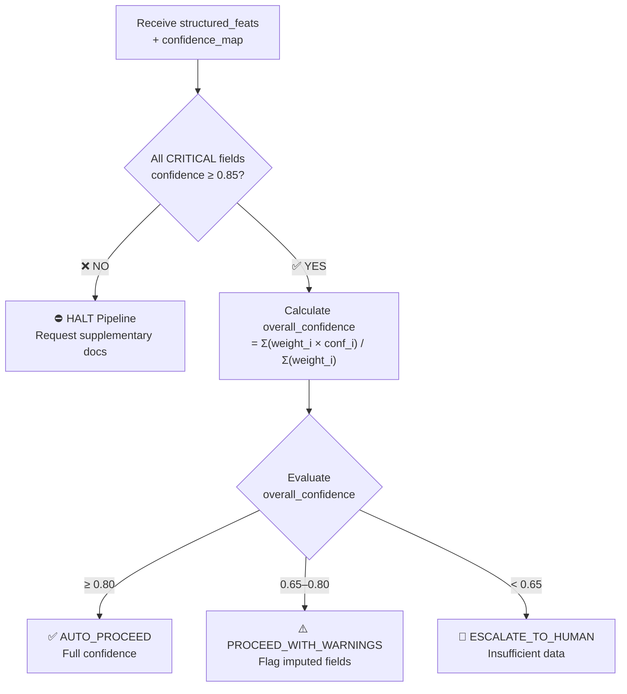

**Weight System:**
- CRITICAL fields: weight = 3
- IMPORTANT fields: weight = 2  
- OPTIONAL fields: weight = 1

---

## 4. Chi tiết Agent A1 — Data Ingestion

### 4.1 Tổng quan

**Mục tiêu:** Nhận hồ sơ thô từ 3 kênh, trả về structured feature vector. Đây là nơi alternative data được khai thác để giải quyết thin-file problem.

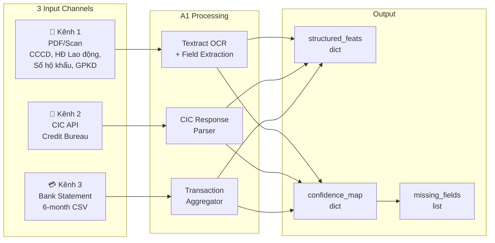

### 4.2 Kênh 1 — PDF/Scan Processing

| Loại tài liệu | AWS Textract API | Output Fields |
|---------------|-----------------|---------------|
| CCCD/CMND | Analyze Lending → page classification | identity_fields (name, DOB, ID number) |
| Hợp đồng lao động | Key-value pair extraction | employment_fields (employer, salary, duration) |
| Sổ hộ khẩu | Table extraction | family_composition |
| TSBĐ (tài sản thế chấp) | Document classification | collateral_fields (type, value) |
| GPKD (SME) | Entity extraction | business_fields (reg_number, industry, age) |

**Validation cross-check:**
```
identity_consistency_flag ∈ {OK, MISMATCH, MISSING}
  → Cross-check: tên trên CCCD vs hợp đồng vs đơn vay
  → Date range checks, format validation
```

### 4.3 Kênh 2 — CIC API Response

```python
# CIC API Response → Mapped features
cic_response = {
    "cic_score":         650,      # 150–750; null nếu thin-file
    "debt_group":        1,        # 1=current, 2=watchlist, 3-5=bad debt
    "num_active_loans":  2,        # số khoản vay đang hoạt động
    "total_outstanding": 150_000_000,  # tổng dư nợ VND
    "worst_ever_group":  2,        # nhóm nợ xấu nhất lịch sử
    "thin_file_flag":    False     # True → activate alternative scoring path
}
```

> **⚠️ Thin-file handling:** Nếu CIC không có record, hệ thống **KHÔNG từ chối** — chuyển sang Alternative Scoring Path với weight cao hơn cho transaction data.

### 4.4 Kênh 3 — Bank Statement (Alternative Data — Core Innovation)

Đây là **tính năng cốt lõi** phân biệt CreditLens với traditional scoring:

| Feature | Type | Công thức & Ý nghĩa |
|---------|------|---------------------|
| `avg_monthly_inflow_vnd` | float | `Mean(monthly_credit_sum, 6M)` — Proxy thu nhập thực tế |
| `income_stability_index` | float [0,1] | `1 - std(monthly_inflows)/mean` — Gần 1 = ổn định |
| `salary_pattern_detected` | bool | Credit ≈ same_amount (±5%), ngày 1-5, nội dung match `LUONG\|SALARY` |
| `regular_bill_payment_ratio` | float [0,1] | % tháng có debit khớp pattern: DIEN, NUOC, VTC/FPT/VNPT |
| `debt_service_behavior` | enum | NLP detect loan repayments: `ON_TIME / LATE_1_30 / LATE_31_60 / MISSING` |
| `overdraft_count_6m` | int | Số lần balance < 500,000 VND hoặc < 0 |
| `inflow_outflow_ratio` | float | `Mean(inflow) / Mean(outflow)` — > 1.2 = healthy |
| `max_single_outflow_ratio` | float | `Max(single_debit) / avg_monthly_inflow` — phát hiện rủi ro thanh khoản |

#### Ví dụ xử lý Bank Statement:

```python
# ── Ví dụ: Parse bank statement CSV → extract features ──
import pandas as pd
import re

def extract_transaction_features(csv_path: str) -> dict:
    """Parse 6-month bank statement → 8 alternative data features."""
    df = pd.read_csv(csv_path, parse_dates=["date"])
    df["month"] = df["date"].dt.to_period("M")

    # 1. Monthly inflow
    monthly_inflow = df[df["amount"] > 0].groupby("month")["amount"].sum()
    avg_inflow = monthly_inflow.mean()

    # 2. Income stability
    stability = 1 - (monthly_inflow.std() / monthly_inflow.mean())

    # 3. Salary pattern detection
    salary_regex = re.compile(r"LUONG|SALARY|THU NHAP", re.IGNORECASE)
    salary_txns = df[
        (df["amount"] > 0) &
        (df["description"].str.contains(salary_regex, na=False))
    ]
    salary_detected = len(salary_txns) >= 3  # min 3 months

    # 4. Bill payment ratio
    bill_regex = re.compile(r"DIEN|NUOC|VTC|FPT|VNPT|INTERNET", re.I)
    bill_months = df[df["description"].str.contains(bill_regex, na=False)]["month"].nunique()
    bill_ratio = bill_months / df["month"].nunique()

    # 5. Overdraft count
    daily_balance = df.groupby("date")["running_balance"].last()
    overdraft_count = (daily_balance < 500_000).sum()

    # 6. Inflow/Outflow ratio
    monthly_outflow = df[df["amount"] < 0].groupby("month")["amount"].sum().abs()
    io_ratio = monthly_inflow.mean() / monthly_outflow.mean()

    return {
        "avg_monthly_inflow_vnd": round(avg_inflow),
        "income_stability_index": round(stability, 3),
        "salary_pattern_detected": salary_detected,
        "regular_bill_payment_ratio": round(bill_ratio, 3),
        "debt_service_behavior": "ON_TIME",  # determined via NLP
        "overdraft_count_6m": int(overdraft_count),
        "inflow_outflow_ratio": round(io_ratio, 3),
        "max_single_outflow_ratio": round(
            df[df["amount"] < 0]["amount"].abs().max() / avg_inflow, 3
        ),
    }
```

### 4.5 Critical Field Threshold System

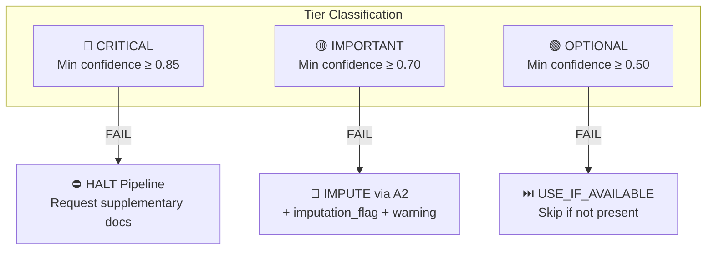

| Tier | Fields | Min Confidence | Action if Below |
|------|--------|---------------|-----------------|
| 🔴 CRITICAL | `identity_verified`, `monthly_income_or_inflow`, `debt_group` (or `thin_file_flag`) | ≥ 0.85 | **HALT** — dừng pipeline, yêu cầu tài liệu bổ sung |
| 🟡 IMPORTANT | `employment_duration`, `collateral_value`, `income_stability_index`, `debt_service_behavior` | ≥ 0.70 | **IMPUTE** — chuyển A2 LLM Imputer + ghi flag |
| 🟢 OPTIONAL | `regular_bill_payment`, `overdraft_count`, `transaction_network` | ≥ 0.50 | **USE_IF_AVAILABLE** — bỏ qua nếu không có |

---

## 5. Chi tiết Agent A2 — LLM Feature Engineer

### 5.1 Tổng quan

**Mục tiêu:** Khai thác tín hiệu từ văn bản phi cấu trúc + impute missing fields có căn cứ. LLM ở đây là **data transformer**, không phải decision maker.

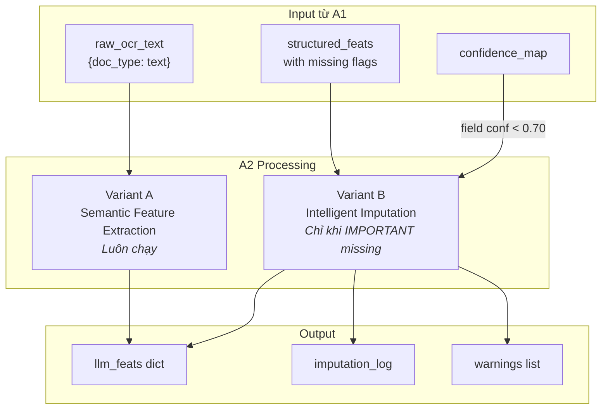

### 5.2 Variant A — Semantic Feature Extraction

| Input text | Feature được trích xuất | Type & Encoding |
|-----------|------------------------|-----------------|
| Nội dung đơn vay | `loan_purpose_category` | One-hot: PRODUCTION / CONSUMPTION / INVESTMENT / REFINANCING / UNCLEAR |
| Mô tả kế hoạch trả nợ | `repayment_plan_quality` | Ordinal: DETAILED=3, GENERAL=2, VAGUE=1, NONE=0 |
| So sánh thu nhập vs dòng tiền | `stated_income_consistency` | Binary: 1 nếu \|stated - inflow\| < 20% |
| 50 giao dịch gần nhất | `transaction_purpose_distribution` | Dict: {salary, rent, business, retail, transfer} sum=1.0 |
| Mô tả doanh nghiệp (SME) | `business_legitimacy_score` | Float [0,1]: tổng hợp từ reg_age, web_presence, industry_risk |
| Top-5 rủi ro hồ sơ | `risk_flag_count` + `risk_flags_list` | Int + List[str] |

#### Ví dụ Prompt — Loan Application Extraction:

```python
system = """
You are a Vietnamese bank credit analyst assistant.
Analyze the loan application text and return ONLY valid JSON.
DO NOT add explanations. DO NOT invent information not in the text.
If a field cannot be determined from the text, set it to null.
"""

user = f"""
LOAN APPLICATION TEXT:
{ocr_text[:3000]}

Return JSON with exactly these fields:
{{
  "loan_purpose_category": "PRODUCTION|CONSUMPTION|INVESTMENT|REFINANCING|UNCLEAR",
  "repayment_plan_quality": "DETAILED|GENERAL|VAGUE|NONE",
  "stated_income_consistency": true|false|null,
  "risk_flags": ["list", "of", "concern", "strings"],
  "positive_signals": ["list", "of", "strength", "strings"],
  "extraction_confidence": 0.0-1.0
}}
"""

# Parsing with validation
response = claude.messages.create(model="claude-3-5-sonnet", ...)
result = json.loads(response.content[0].text)
assert set(result.keys()) == REQUIRED_KEYS  # schema validation
```

### 5.3 Variant B — Intelligent Imputation

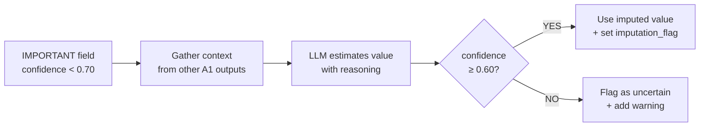

#### Ví dụ Imputation — Monthly Income:

```python
# Trường hợp: monthly_income = null nhưng có bank statement
context = {
    "avg_monthly_inflow": 14_800_000,
    "salary_pattern": True,
    "employment": "FULL_TIME",
    "salary_months_detected": 6
}

prompt = f"""
Context data from bank statement analysis:
{json.dumps(context)}

Estimate net monthly income for this applicant.
Return ONLY JSON:
{{
  "estimated_value": <number>,
  "confidence": <0.0-1.0>,
  "reasoning": "<1 sentence>",
  "source": "<data source used>"
}}
"""

# Output example:
imputation_result = {
    "estimated_value": 14_000_000,
    "confidence": 0.81,
    "reasoning": "6-month consistent salary inflow averaging 14.8M",
    "source": "inferred_from_6mo_bank_statement"
}

# → imputation_flag = True → appears in final report Section 4
```

### 5.4 Thin-file Alternative Scoring Path

Khi `thin_file_flag = True`, A2 kích hoạt alternative feature weights:

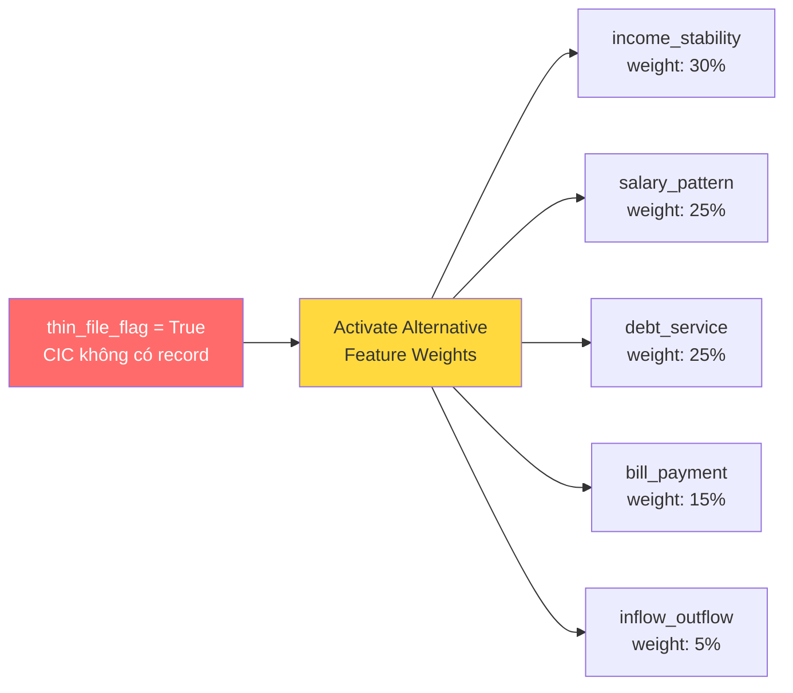

**Requirements:**
- Minimum: ≥ 3 tháng sao kê liên tục — dưới mức này → ESCALATE
- Report flag: *"Khách hàng được đánh giá theo hướng thin-file. Kết quả dựa trên dữ liệu giao dịch thay thế."*

---

## 6. Chi tiết Agent A3 — ML Scoring Engine

### 6.1 Tổng quan

**Mục tiêu:** Nhận unified feature vector, trả về credit score với mathematical explainability. Component **deterministic** duy nhất — same input luôn cho same output.

### 6.2 Unified Feature Vector — 25 features, 6 groups

| Feature Group | Count | Home Credit Mapping | Pilot (10 core) |
|--------------|-------|-------------------|-----------------|
| Identity & KYC | 3 | `CODE_GENDER`, `DAYS_BIRTH`, `FLAG_OWN_CAR` | age, gender, id_verified |
| Credit Bureau | 4 | `bureau.csv`: `CREDIT_ACTIVE`, `DAYS_CREDIT`, `AMT_CREDIT_SUM_OVERDUE` | cic_score, debt_group, num_active_loans, thin_file_flag |
| Transaction Behavioral ★ | 8 | Engineered từ `installments_payments.csv` + `credit_card_balance.csv` | avg_inflow, income_stability, salary_detected, bill_payment_ratio, debt_service, overdraft_count |
| LLM Semantic (A2-A) | 5 | Extracted từ documents (không có sẵn trong Home Credit) | loan_purpose_cat, repayment_quality, stated_income_consistency |
| Imputed fields (A2-B) | 2 | Proxy cho `EXT_SOURCE_1/2/3` | income_imputed_flag, imputation_confidence |
| Loan Terms | 3 | `AMT_CREDIT`, `AMT_ANNUITY`, `AMT_INCOME_TOTAL` | loan_amount_vnd, term_months, dti_ratio |
| **TỔNG** | **25** | | **10 core cho pilot** |

### 6.3 Training Pipeline

```python
import lightgbm as lgb
import shap
from imblearn.over_sampling import ADASYN

# 1. Load & merge tables
app = pd.read_csv("application_train.csv")         # 307,511 rows
bureau = pd.read_csv("bureau.csv")                  # aggregated per SK_ID_CURR
installments = pd.read_csv("installments_payments.csv")

# 2. Feature engineering — transaction behavioral features
installments_feats = installments.groupby("SK_ID_CURR").agg({
    "NUM_INSTALMENT_NUMBER": "max",
    "DAYS_INSTALMENT": "mean",
    "AMT_INSTALMENT": ["mean", "std"],
    "AMT_PAYMENT": "sum",
}).reset_index()
installments_feats["payment_consistency"] = 1 - (
    installments_feats[("AMT_INSTALMENT","std")] /
    installments_feats[("AMT_INSTALMENT","mean")]
)

# 3. Class imbalance: ADASYN (target 5:1 ratio)
adasyn = ADASYN(sampling_strategy=0.2, random_state=42)
X_res, y_res = adasyn.fit_resample(X_train, y_train)

# 4. LightGBM with Optuna-tuned hyperparameters
params = {
    "objective": "binary",     "metric": "auc",
    "n_estimators": 500,       "learning_rate": 0.05,
    "max_depth": 6,            "num_leaves": 31,
    "min_child_samples": 20,   "subsample": 0.8,
    "colsample_bytree": 0.8,   "is_unbalance": True,
    "random_state": 42
}
model = lgb.LGBMClassifier(**params)
model.fit(X_res, y_res, eval_set=[(X_val, y_val)],
          callbacks=[lgb.early_stopping(50), lgb.log_evaluation(100)])
```

### 6.4 Credit Score Mapping & Decision Matrix

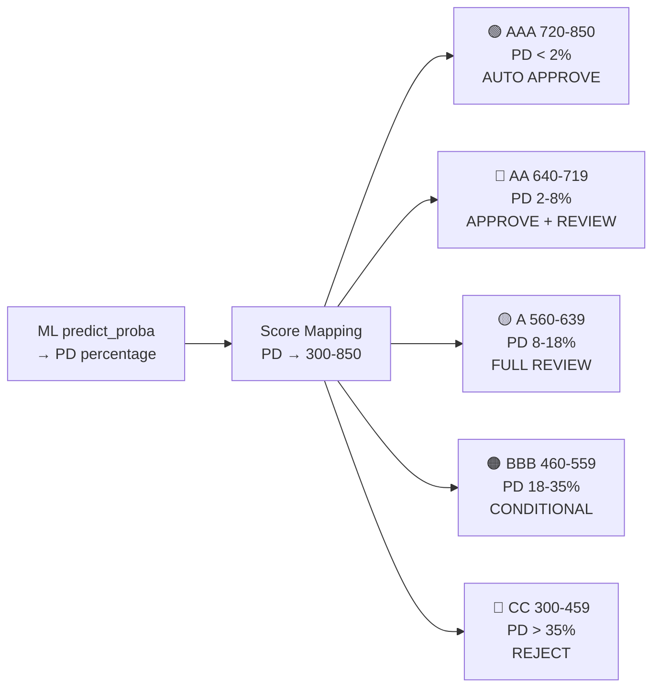

| Risk Band | Credit Score | PD Range | Auto Decision | Điều kiện cộng thêm |
|-----------|-------------|----------|--------------|---------------------|
| AAA — Xuất sắc | 720–850 | < 2% | AUTO APPROVE | + CIC Nhóm 1 + DTI < 40% |
| AA — Tốt | 640–719 | 2%–8% | APPROVE + REVIEW | Chuyên viên xem nhanh báo cáo |
| A — Khá | 560–639 | 8%–18% | FULL REVIEW | Đánh giá đầy đủ 4C |
| BBB — Trung bình | 460–559 | 18%–35% | CONDITIONAL | Cần thêm TSBĐ hoặc guarantor |
| CC — Rủi ro cao | 300–459 | > 35% | REJECT | Trừ đặc cách thẩm quyền cao |

**Hard Override Rules (Policy-based):**
- CIC Nhóm 4-5 → **REJECT** bất kể ML score
- Loan amount > 10 tỷ VND → **ESCALATE** to head office
- overall_confidence < 0.65 → **HUMAN REVIEW**
- thin_file_flag=True + score < 560 → tăng yêu cầu TSBĐ

### 6.5 SHAP Output Schema — Bridge sang A4

```json
{
  "credit_score": 672,
  "pd_pct": 5.8,
  "risk_band": "AA",
  "model_version": "lgbm_v1.2_homecredit",
  "inference_timestamp": "2026-03-18T10:23:41Z",

  "top_positive_factors": [
    {"feature": "salary_pattern_detected",    "shap": +0.089, "value": true,  "label_vi": "Phát hiện giao dịch lương đều đặn"},
    {"feature": "income_stability_index",     "shap": +0.072, "value": 0.81, "label_vi": "Thu nhập ổn định 6 tháng (index 0.81)"},
    {"feature": "regular_bill_payment_ratio", "shap": +0.051, "value": 0.90, "label_vi": "Thanh toán hóa đơn đúng hạn 90%"},
    {"feature": "repayment_plan_quality",     "shap": +0.038, "value": 3,    "label_vi": "Kế hoạch trả nợ chi tiết"},
    {"feature": "stated_income_consistency",  "shap": +0.029, "value": true,  "label_vi": "Thu nhập khai báo khớp sao kê"}
  ],

  "top_negative_factors": [
    {"feature": "dti_ratio",             "shap": -0.063, "value": 0.48, "label_vi": "Tỷ lệ nợ/thu nhập ở mức cao (48%)"},
    {"feature": "overdraft_count_6m",    "shap": -0.031, "value": 2,   "label_vi": "Số dư về âm 2 lần trong 6 tháng"},
    {"feature": "imputation_confidence", "shap": -0.018, "value": 0.81,"label_vi": "Một số trường được ước tính (confidence 81%)"}
  ],

  "4c_shap_allocation": {
    "character":  {"shap_sum": 0.118, "pct": 28},
    "capacity":   {"shap_sum": 0.172, "pct": 41},
    "capital":    {"shap_sum": 0.080, "pct": 19},
    "conditions": {"shap_sum": 0.050, "pct": 12}
  }
}
```

---

## 7. Chi tiết Agent A4 — Report Generator & Explainability Stack

### 7.1 Ba tầng Explainability

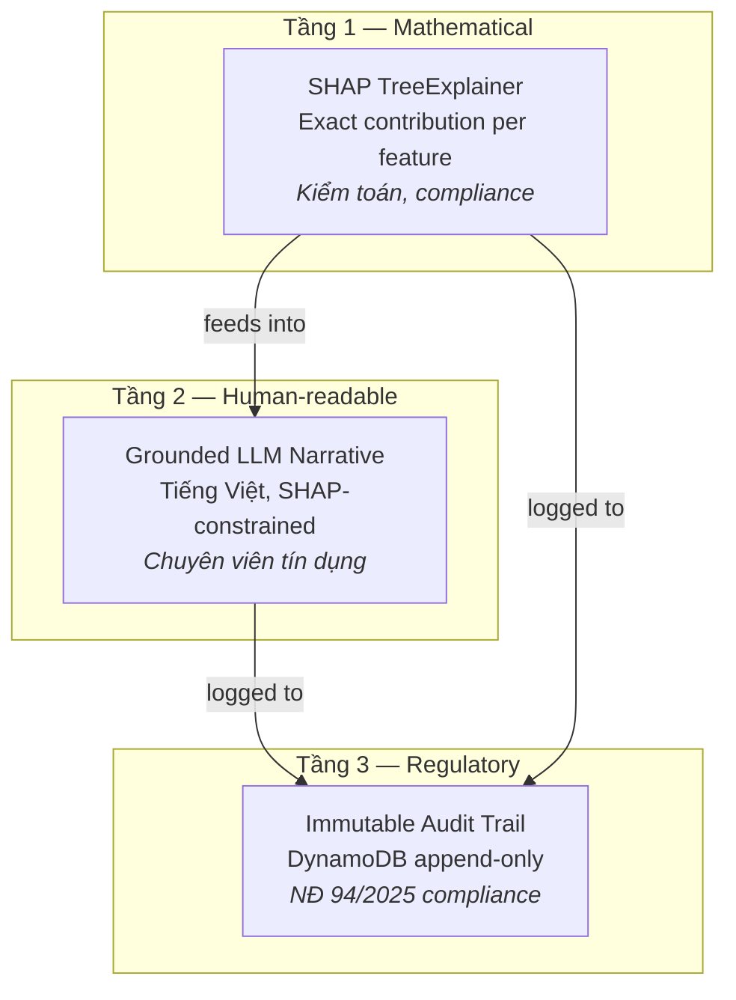

| Tầng | Mechanism | Ai dùng |
|------|-----------|---------|
| **Tầng 1** | SHAP TreeExplainer — toán học: consistency, efficiency, additivity | Kiểm toán nội bộ, compliance |
| **Tầng 2** | LLM diễn giải SHAP → tiếng Việt, constraint: chỉ đề cập factors trong SHAP | Chuyên viên tín dụng |
| **Tầng 3** | DynamoDB append-only log mọi action: input, output, timestamp, model_version | Regulatory compliance |

> **⚠️ Implementation Status (v1.1):** Tầng 3 audit trail hiện lưu trữ in-memory trong `CreditState.audit_trail`. DynamoDB persistence service sẽ được implement trong Week 3–4. Schema đã định nghĩa đầy đủ trong `credit_state.py`.

### 7.2 RAG Pipeline — Policy Grounding

- **Knowledge Base:** Thông tư NHNN phân loại nợ, quy định CIC 2024, điều kiện sản phẩm vay
- **Vector Store:** AWS OpenSearch Serverless + Amazon Titan Text V2 embeddings
- **Query flow:** A4 tạo query dựa trên hồ sơ → retrieve top-3 policy clauses → inject vào prompt
- **Citation requirement:** LLM phải cite số thông tư/điều khoản cụ thể

> **⚠️ Implementation Status (v1.1):** RAG pipeline hiện đang ở giai đoạn placeholder. OpenSearch Serverless và knowledge base ingestion sẽ được implement trong Week 3. Hiện tại, `rag_context` trong prompt template sử dụng placeholder text.

### 7.3 Consistency Validator

```python
def validate_narrative_consistency(shap_output, narrative):
    """
    Deterministic check: LLM narrative chỉ references factors trong SHAP.
    Returns: {passed: bool, violations: list[str], shap_coverage: float}
    """
    top_shap_labels = {f["label_vi"] for f in
        shap_output["top_positive_factors"] + shap_output["top_negative_factors"]}

    violations = []
    for dimension in ["character", "capacity", "capital", "conditions"]:
        text = narrative[f"{dimension}_assessment"]["narrative"]
        claim_has_shap_support = any(
            label.lower() in text.lower() for label in top_shap_labels
        )
        if not claim_has_shap_support:
            violations.append(f"{dimension}: narrative lacks SHAP grounding")

    return {
        "passed": len(violations) == 0,
        "violations": violations,
        "shap_coverage": len(top_shap_labels & extract_mentioned_topics(text))
                         / len(top_shap_labels)
    }

# If fails → re-prompt A4 with violation list (max 2 retries)
# Still fails → flag report for human review
```

### 7.4 Output — Cấu trúc Báo cáo Tín dụng

| Section | Nội dung | Người dùng chính |
|---------|---------|-----------------|
| **1. Executive Summary** | Credit Score, Risk Band, Khuyến nghị, PD%, Confidence | Giám đốc chi nhánh |
| **2. 4C Scorecard** | Character/Capacity/Capital/Conditions — điểm, trạng thái, SHAP% | Chuyên viên tín dụng |
| **3. Phân tích Chi tiết** | Indicators MET / NEEDS REVIEW + LLM Narrative per 4C | Chuyên viên tín dụng |
| **4. Data Warnings** | Imputed fields, low-confidence, thin-file flag | Compliance officer |
| **5. Audit Reference** | application_id, model_version, SHAP hash, RAG chunks | Kiểm toán |

---

## 8. Home Credit Dataset — Schema & Mapping

### 8.1 Entity Relationship Diagram

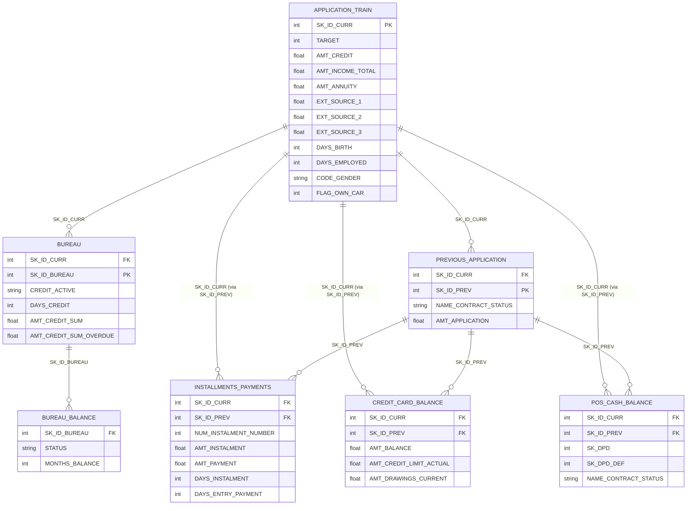

### 8.2 Dataset Summary

| Bảng | Rows | Mô tả | Key Features sử dụng |
|------|------|--------|----------------------|
| `application_train.csv` | 307,511 | Bảng chính: thông tin cá nhân, tài chính, khoản vay. **TARGET = 0/1** | AMT_CREDIT, AMT_INCOME_TOTAL, DAYS_BIRTH, EXT_SOURCE_1/2/3 |
| `bureau.csv` | 1.7M | Lịch sử tín dụng từ credit bureau | CREDIT_ACTIVE, DAYS_CREDIT, AMT_CREDIT_SUM_OVERDUE |
| `installments_payments.csv` | 13.6M | Lịch sử trả góp từng kỳ | DAYS_INSTALMENT vs DAYS_ENTRY_PAYMENT, AMT_INSTALMENT stability |
| `credit_card_balance.csv` | 3.8M | Thẻ tín dụng | AMT_BALANCE/AMT_CREDIT_LIMIT_ACTUAL → credit utilization |
| `pos_cash_balance.csv` | 10.0M | POS và tiền mặt | DPD → overdraft proxy, SK_DPD_DEF → debt_service proxy |
| `previous_application.csv` | 1.67M | Lịch sử đơn vay trước | NAME_CONTRACT_STATUS → loan purpose history |
| `bureau_balance.csv` | 27.3M | Monthly balance of bureau credits | STATUS → payment history pattern |

### 8.3 Feature Engineering — Home Credit → Production Mapping

| Production Feature | Home Credit Proxy | Engineering Logic |
|-------------------|-------------------|-------------------|
| `income_stability_index` | `installments_payments: AMT_INSTALMENT` | `1 - std(AMT_INSTALMENT)/mean(AMT_INSTALMENT)` per SK_ID_CURR |
| `salary_pattern_detected` | `DAYS_EMPLOYED` + `income_stability_index` | `DAYS_EMPLOYED < 0` (employed) AND `income_stability_index > 0.7` → True |
| `debt_service_behavior` | `pos_cash: SK_DPD, SK_DPD_DEF` | max(SK_DPD): 0→ON_TIME, 1-30→LATE_1_30, >30→LATE_31_60 |
| `overdraft_count_6m` | `pos_cash: NAME_CONTRACT_STATUS` | Count months where SK_DPD > 0 in last 6 entries |
| `inflow_outflow_ratio` | `credit_card: AMT_DRAWINGS / AMT_BALANCE` | (AMT_INCOME_TOTAL/12) / (AMT_ANNUITY + avg_drawings) |
| `cic_score` (proxy) | `EXT_SOURCE_1, EXT_SOURCE_2, EXT_SOURCE_3` | 0.5×EXT_SOURCE_2 + 0.3×EXT_SOURCE_3 + 0.2×EXT_SOURCE_1, scale to 150-750 |

### 8.4 Train / Validation / Test Split

| Split | Records | Mục đích | Lưu ý |
|-------|---------|---------|-------|
| Train | 215,258 (70%) | LightGBM training | Stratified by TARGET, ADASYN applied |
| Validation | 46,127 (15%) | Hyperparameter tuning, early stopping | No ADASYN — real distribution |
| Test (held-out) | 46,126 (15%) | Final AUC, KS, Gini evaluation | Locked — không xem trong quá trình build |
| Pilot test set | 40 (expert curated) | Final pilot — 25 individual + 15 SME proxy | 50% default / 50% non-default |

---

## 9. Sequence Diagrams — Luồng xử lý End-to-End

### 9.1 Happy Path — Full Pipeline

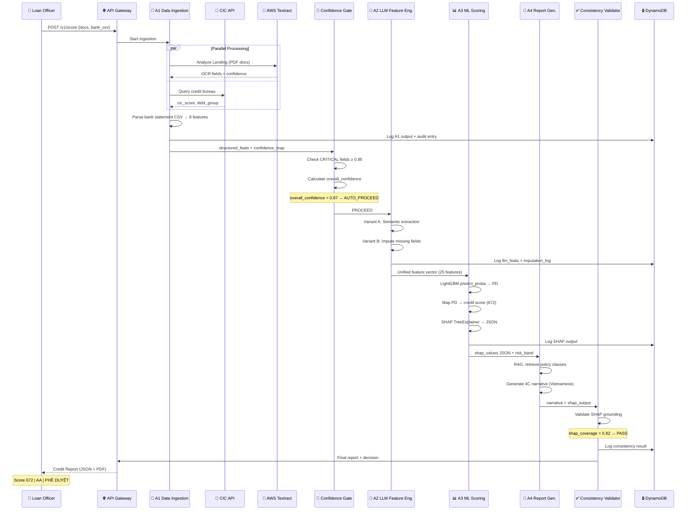

### 9.2 Thin-file Path — Không có CIC

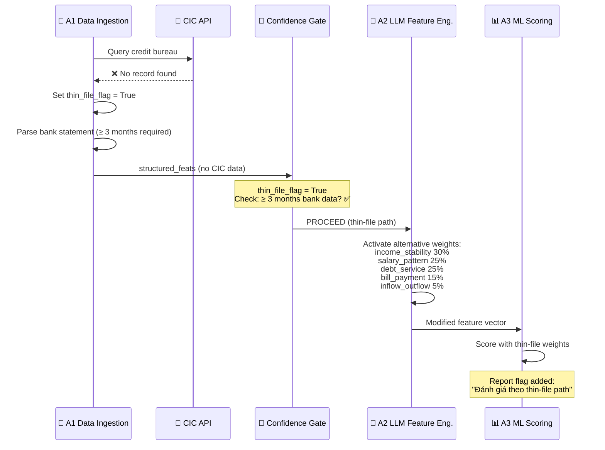

### 9.3 HALT Path — Critical Field Missing

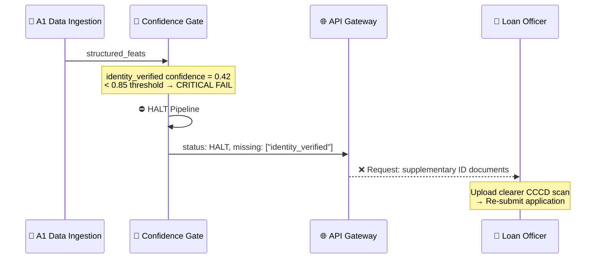

---

## 10. Ví dụ xử lý thực tế — End-to-End Case Study

### 10.1 Case: Nguyễn Văn A — Individual, Thin-file

**Input:**
- CCCD scan (quality: good)
- Hợp đồng lao động (6 tháng)
- Bank statement CSV (6 tháng, VPBank)
- CIC: **không có record** (thin-file)
- Mục đích vay: mua xe máy Honda SH, 80 triệu VND

**Step 1 — A1 Data Ingestion:**
```python
a1_output = {
    "structured_feats": {
        "identity_verified": True,
        "age": 28,
        "gender": "M",
        "employment_type": "FULL_TIME",
        "employer": "FPT Software",
        "stated_monthly_income": 15_000_000,
        "employment_duration_months": 6,
        "loan_amount_vnd": 80_000_000,
        "term_months": 24,
        # CIC
        "cic_score": None,  # thin-file
        "thin_file_flag": True,
        # Bank statement features
        "avg_monthly_inflow_vnd": 14_800_000,
        "income_stability_index": 0.81,
        "salary_pattern_detected": True,
        "regular_bill_payment_ratio": 0.90,
        "debt_service_behavior": "ON_TIME",
        "overdraft_count_6m": 2,
        "inflow_outflow_ratio": 1.35,
        "max_single_outflow_ratio": 0.42
    },
    "confidence_map": {
        "identity_verified": 0.95,
        "monthly_income": 0.88,
        "thin_file_flag": 1.0,
        "income_stability_index": 0.85,
        "salary_pattern_detected": 0.92,
        "employment_duration": 0.65  # → below 0.70 → IMPUTE
    },
    "missing_fields": ["cic_score"]
}
```

**Step 2 — Confidence Gate:**
```
CRITICAL fields check:
  ✅ identity_verified: 0.95 ≥ 0.85
  ✅ monthly_income: 0.88 ≥ 0.85
  ✅ thin_file_flag: 1.0 ≥ 0.85

overall_confidence = (3×0.95 + 3×0.88 + 3×1.0 + 2×0.85 + 2×0.92 + 2×0.65 + 1×0.90)
                   / (3+3+3+2+2+2+1) = 0.877

Result: AUTO_PROCEED ✅ (0.877 ≥ 0.80)
Note: employment_duration (0.65) flagged for imputation
```

**Step 3 — A2 LLM Feature Engineer:**
```python
# Variant A output (semantic extraction)
a2_semantic = {
    "loan_purpose_category": "CONSUMPTION",
    "repayment_plan_quality": 2,  # GENERAL
    "stated_income_consistency": True,  # |15M - 14.8M| < 20%
    "risk_flag_count": 1,
    "risk_flags": ["Overdraft 2 times in 6 months"]
}

# Variant B output (imputation for employment_duration)
a2_imputed = {
    "employment_duration_months": 8,
    "imputation_confidence": 0.72,
    "source": "salary_history_6mo + contract_date"
}
```

**Step 4 — A3 ML Scoring:**
```
predict_proba → PD = 5.8%
credit_score = 672 (AA — Tốt)
risk_band = "AA"
SHAP top factors: salary_pattern (+0.089), income_stability (+0.072)
SHAP top risks: dti_ratio (-0.063), overdraft (-0.031)
```

**Step 5 — A4 Report Output (Executive Summary):**

| Field | Value |
|-------|-------|
| Credit Score | **672 / 850** |
| Risk Band | **AA — Rủi ro Thấp** |
| Khuyến nghị | **PHÊ DUYỆT** (APPROVE + REVIEW) |
| Xác suất vỡ nợ | 5.8% |
| Confidence | 87.7% |
| ⚠️ Cảnh báo | Thin-file: không có lịch sử CIC. Đánh giá dựa trên alternative data. |
| ⚠️ Cảnh báo | employment_duration được ước tính (8 tháng, confidence 72%) |

---

## 11. Deployment Architecture — AWS

### 11.1 Infrastructure Diagram

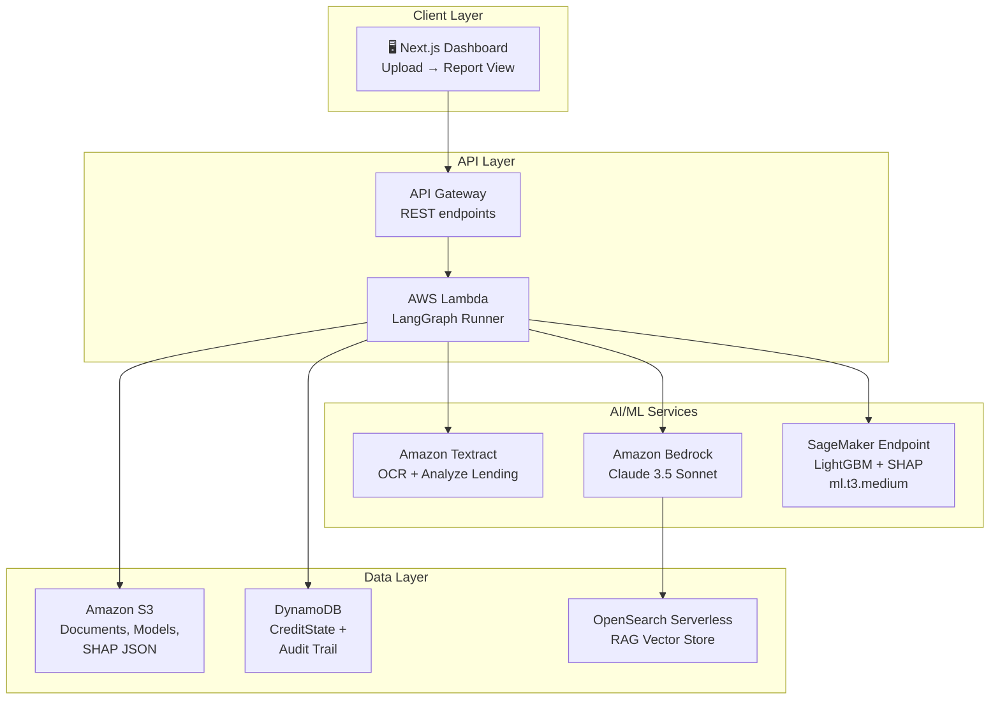

### 11.2 AWS Services & Cost

| Service | Role | Agent | Pilot cost/month |
|---------|------|-------|-----------------|
| Amazon Textract | OCR + Analyze Lending API | A1 | ~$15 |
| Amazon Bedrock (Claude 3.5) | LLM inference — A2 + A4 | A2, A4 | ~$30–50 |
| SageMaker RT Endpoint | LightGBM model hosting + SHAP | A3 | ~$50 |
| OpenSearch Serverless | RAG vector store cho policy docs | A4 | ~$100 |
| Lambda + API Gateway | REST API, LangGraph runner | All | ~$5 |
| DynamoDB | CreditState + audit trail | All | ~$5 |
| S3 | Document storage, model artifacts | All | ~$3 |
| **TỔNG PILOT** | | | **~$210–230/month** |

---

## 12. So sánh CreditLens vs MASCA

| Dimension | MASCA | CreditLens |
|-----------|-------|-----------|
| **Source of explanation** | LLM chain-of-thought — post-hoc rationalization | SHAP TreeExplainer — mathematical attribution |
| **Traceability** | Cannot trace claim → data point. LLM may confabulate | Every SHAP value traceable đến feature value |
| **Consistency** | Accuracy drops 6.96% when gender flipped | LightGBM deterministic, SHAP consistent |
| **Auditability** | No structured audit trail | Immutable DynamoDB, SHAP JSON hash verifiable |
| **Policy grounding** | LLM cites từ training knowledge — may hallucinate | RAG từ current policy docs + citation verification |
| **Key distinction** | LLM creates causal links (opinion) | SHAP calculates causal links (mathematical fact), LLM translates |

---

## 13. Chiến lược đánh giá & KPI

### 13.1 Quantitative Metrics

| Metric | Target | Cách đo |
|--------|--------|---------|
| AUC-ROC | > 0.80 | sklearn on held-out 15% test set |
| Pilot accuracy (40 cases) | ≥ 95% (38/40) | Binary correct/incorrect full pipeline |
| Gini Coefficient | > 0.60 | 2 × AUC − 1 |
| Thin-file sub-AUC | > 0.72 | Sub-group AUC on thin_file_flag=True records |
| SHAP consistency | > 0.80 | shap_coverage in consistency_validator |

### 13.2 Ablation Study

| Experiment | AUC Expected | ΔAUC | Component Justified |
|-----------|-------------|------|-------------------|
| E0: Logistic Regression, CIC only | ~0.65 | — | Traditional baseline |
| E1: LightGBM, tabular only | ~0.75 | +0.10 | ML over logistic |
| E2: + Transaction alt data | ~0.79 | +0.04 | Alternative data value |
| E3: + LLM Semantic features | ~0.81 | +0.02 | Unstructured doc analysis |
| E4: + LLM Imputation (Full) | > 0.82 | +0.01 | Smart imputation |

### 13.3 Build Timeline — 4 Weeks

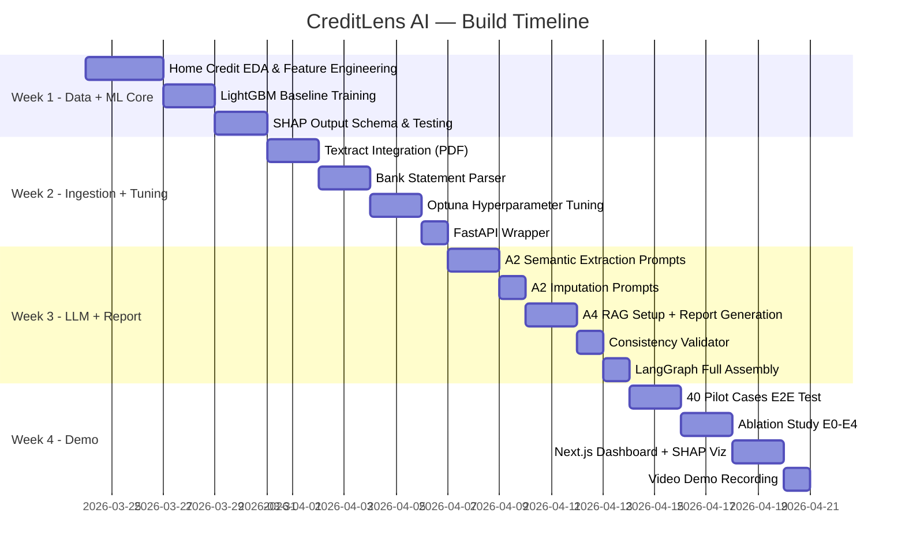

---

## 14. Phụ lục

### 14.1 Tài liệu Tham khảo

| # | Tài liệu | Nguồn |
|---|----------|-------|
| 1 | Home Credit Default Risk Dataset | kaggle.com/competitions/home-credit-default-risk |
| 2 | GPT-LGBM: ChatGPT-Based Framework for Credit Scoring | Yu et al. (2023), Knowledge and Information Systems |
| 3 | Cash Flow Underwriting with Bank Transaction Data | Ng et al. (2025), arXiv:2510.16066 |
| 4 | Leveraging Transactional Data for Micro and Small Enterprise Lending | CGAP (2023) |
| 5 | MASCA: LLM-based Multi-Agent System for Credit Assessment | Jajoo et al. (2025), arXiv:2507.22758 |
| 6 | SHAP and LIME: Discriminative Power in Credit Risk | Gramegna & Giudici (2021), Frontiers in AI |
| 7 | ML-Based Credit Scoring in Vietnam | Springer (2021) |
| 8 | Fintech Credit Risk for SMEs: Evidence from China | IMF Working Paper (2020) |

### 14.2 Technology Stack

| Layer | Technology | Version |
|-------|-----------|---------|
| ML Framework | LightGBM | 4.x |
| Explainability | SHAP (TreeExplainer) | 0.44+ |
| LLM | Claude 3.5 Sonnet (via Bedrock) | Latest |
| Orchestration | LangGraph | 0.2+ |
| Oversampling | imbalanced-learn (ADASYN) | 0.12+ |
| Hyperparameter Tuning | Optuna | 3.x |
| API Framework | FastAPI | 0.100+ |
| Frontend | Next.js | 14+ |
| Cloud | AWS (Textract, Bedrock, SageMaker, etc.) | - |

### 14.3 Glossary

| Thuật ngữ | Giải thích |
|----------|-----------|
| **CIC** | Credit Information Center — Trung tâm Thông tin Tín dụng Quốc gia |
| **Thin-file** | Khách hàng không có hoặc rất ít lịch sử tín dụng |
| **SHAP** | SHapley Additive exPlanations — phương pháp giải thích ML dựa trên lý thuyết trò chơi |
| **4C** | Character, Capacity, Capital, Conditions — 4 tiêu chí đánh giá tín dụng |
| **PD** | Probability of Default — xác suất vỡ nợ |
| **DTI** | Debt-to-Income ratio — tỷ lệ nợ trên thu nhập |
| **ADASYN** | Adaptive Synthetic Sampling — kỹ thuật oversampling cho class imbalance |
| **RAG** | Retrieval-Augmented Generation — truy vấn knowledge base trước khi generate |
| **AUC-ROC** | Area Under the ROC Curve — metric đánh giá classification model |
| **TSBĐ** | Tài sản bảo đảm — collateral |
| **GPKD** | Giấy phép kinh doanh — business registration |
| **CCCD** | Căn cước công dân — citizen identity card |

---

> **Document version:** 1.1 | **Last updated:** 2026-03-20 | **Authors:** CreditLens AI Team
