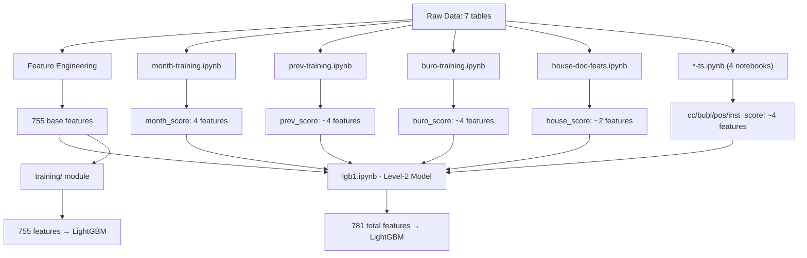

# Đánh giá chi tiết: Training, Feature Engineering & So sánh Feature Count

## 1. Tổng quan kiến trúc

| Thành phần | File | Vai trò |
|---|---|---|
| **lgb1.ipynb** | [home-credit-default-risk-master/notebooks/lgb1.ipynb](file:///d:/project/swinburn_new/home-credit-default-risk-master/notebooks/lgb1.ipynb) | Notebook gốc Kaggle (Private LB 0.7998, Public LB 0.8050, Local CV 0.8020). Sử dụng **ensemble stacking** từ 8 notebook phụ |
| **training/** module | [training/feature_engineering.py](file:///d:/project/swinburn_new/training/feature_engineering.py), [train_pipeline.py](file:///d:/project/swinburn_new/training/train_pipeline.py), [precompute_fe_stats.py](file:///d:/project/swinburn_new/training/precompute_fe_stats.py) | Phiên bản "sản phẩm hóa" — chỉ replicate phần **feature engineering cơ bản**, KHÔNG có stacking |

> [!IMPORTANT]
> lgb1.ipynb thực chất là **Level-2 stacking model** — nó dùng prediction scores từ 8 sub-models làm meta-features. Training module chỉ replicate phần Level-1 (feature engineering + single LightGBM).

---

## 2. So sánh Feature Count — Kết quả đã xác minh

### 2.1. Số liệu chính xác (từ code output)

| Metric | lgb1.ipynb (cell 21 output) | training/ module (`fe_stats.pkl`) |
|---|---|---|
| **Total columns** | **783** (bao gồm SK_ID_CURR, TARGET) | **757** (bao gồm SK_ID_CURR, TARGET) |
| **Total features dùng cho training** | **781** | **755** |
| **Chênh lệch** | | **~26 features** |
| Mean-encoded features | 40 | ~40 |
| Categorical features | 13 | ~13 |

### 2.2. Nguồn gốc chênh lệch ~26 features

> [!CAUTION]
> **Giả thuyết cũ SAI**: Sự chênh lệch KHÔNG phải do lgb1 combine train+test khi one-hot encoding. Cả hai codebase dùng `pd.get_dummies` trên cùng dữ liệu bureau/previous_application (bảng phụ, chung cho cả train và test).

**Nguyên nhân thực sự**: lgb1.ipynb merge thêm **~26 stacked model prediction scores** từ 8 notebook phụ:

| Notebook phụ | Output file | Features được thêm |
|---|---|---|
| [month-training.ipynb](file:///d:/project/swinburn_new/home-credit-default-risk-master/notebooks/month-training.ipynb) | [agg_month_score.csv](file:///d:/project/swinburn_new/home-credit-default-risk-master/output/agg_month_score.csv) | `month_score_max`, `month_score_std`, `month_score_mean`, `month_score_sum` |
| [prev-training.ipynb](file:///d:/project/swinburn_new/home-credit-default-risk-master/notebooks/prev-training.ipynb) | [agg_prev_score.csv](file:///d:/project/swinburn_new/home-credit-default-risk-master/output/agg_prev_score.csv) | prediction scores từ previous_application sub-model |
| [buro-training.ipynb](file:///d:/project/swinburn_new/home-credit-default-risk-master/notebooks/buro-training.ipynb) | [agg_buro_score.csv](file:///d:/project/swinburn_new/home-credit-default-risk-master/output/agg_buro_score.csv) | `buro_score_var`, `buro_score_sum`, `buro_score_recent2y_sum`, `buro_score_last` |
| [house-doc-feats.ipynb](file:///d:/project/swinburn_new/home-credit-default-risk-master/notebooks/house-doc-feats.ipynb) | `train_house_score.csv` + `house_ex.csv` | `house_score_x`, `house_score_y` |
| [cc-ts.ipynb](file:///d:/project/swinburn_new/home-credit-default-risk-master/notebooks/cc-ts.ipynb) | `cc_score_train.csv` | `cc_score` (credit card time series prediction) |
| [bubl-ts.ipynb](file:///d:/project/swinburn_new/home-credit-default-risk-master/notebooks/bubl-ts.ipynb) | `bubl_score_train.csv` | `bubl_score` (bureau_balance time series prediction) |
| [pos-ts.ipynb](file:///d:/project/swinburn_new/home-credit-default-risk-master/notebooks/pos-ts.ipynb) | `pos_score_train.csv` | `pos_score` (POS cash time series prediction) |
| [inst-ts.ipynb](file:///d:/project/swinburn_new/home-credit-default-risk-master/notebooks/inst-ts.ipynb) | `inst_score_train.csv` | `inst_score` (installments time series prediction) |

**Luồng data trong lgb1.ipynb:**
```
Cell 1-15: FE cơ bản (7 bảng) → merge 5 bảng phụ → 743 columns
Cell 16: Merge stacked scores (+4 month_score) → 747 columns  
Cell 17: Merge prev_score + buro_score (+~10) → ~757 columns
Cell 18: Merge house/cc/bubl/pos/inst scores (+~8) → 765 columns
Cell 19: Cross-table ratio features (+18) → 783 columns ← FINAL
```

### 2.3. Phân tích feature breakdown (training module — 755 features)

| Nhóm | Prefix | Số feature | Ghi chú |
|---|---|---|---|
| Application | *(no prefix)* | 115 | Gốc + engineered + mean_income |
| Bureau | `bureau_*` | 122 | Agg + active + recent + one-hot |
| Credit Card | `cc_*` | 216 | Time-window + scaled + stats |
| POS Cash | `pos_*` | 27 | DPD scaled + contract status |
| Installments | `inst_*` | 27 | Time-weighted payment behavior |
| Previous App | `prev_*` | 230 | Approved/refused + active + defaulted |
| Cross-table | `Total_*` + `*_to_prev_*` | ~18 | Ratios across tables |
| **Tổng** | | **755** | |

---

## 3. Feature Engineering — Chi tiết theo bảng

### 3.1. Application table ([engineer_application_features](file:///d:/project/swinburn_new/training/feature_engineering.py))

**Input**: `application_train.csv` — 307,511 rows × 122 columns

**Processing flow**:

| Bước | Chi tiết | Ví dụ |
|---|---|---|
| Cleaning | Replace `XNA`→NaN, `Unknown`→NaN, `365243`→NaN (DAYS_EMPLOYED) | |
| Ratio features (~25) | Tỷ lệ giữa các cột gốc | `NEW_CREDIT_TO_INCOME_RATIO = AMT_CREDIT / AMT_INCOME_TOTAL` |
| Document/Flag stats | Kurtosis, sum | `NEW_DOC_IND_KURT`, `NEW_LIVE_IND_SUM` |
| EXT_SOURCE combo | Product, mean, std | `NEW_SOURCES_PROD = EXT1 * EXT2 * EXT3` |
| Life-stage features | Age, employment, payoff | `AGE_PAYOFF = -DAYS_BIRTH/365.25 + AMT_PAY_YEAR` |
| Credit bureau inquiry | Change, total | `AMT_REQ_CREDIT_BUREAU_MON_CHANGE`, `_TOTAL` |
| REGION factorize | `REGION_POPULATION_RELATIVE` → `REGION` | Mean-encoded |
| Mean income mapping (7 groups) | Median income by group, then relative ratio | `gender_mean_income_rel = (income - median) / median` |
| Rejected features drop (~35) | Highly correlated features | `APARTMENTS_AVG`, `BASEMENTAREA_MODE`, `ELEVATORS_AVG`, etc. |
| Label encoding | `pd.factorize` cho categoricals | `nunique < 6` → `cat_feats`, `≥ 6` → `meanenc_feats` |

**Sự khác biệt lgb1 vs training module**:
- lgb1: `combined = data.append(test)` — combine train+test TRƯỚC feature engineering → median income, factorize maps tính trên toàn bộ data
- training module: Chỉ dùng `application_train.csv` → median income, factorize maps chỉ từ train set
- **Ảnh hưởng**: Không tạo thêm/bớt columns, nhưng giá trị mapping có thể khác nhỏ

### 3.2. Bureau Balance ([engineer_bureau_balance_features](file:///d:/project/swinburn_new/training/feature_engineering.py))

**Input**: `bureau_balance.csv` — 27.3M rows

| Feature group | Chi tiết |
|---|---|
| DPD tracking | `MONTH_LAST_DPD`: tháng cuối cùng có DPD; `MONTH_LAST_C`: tháng cuối hoàn thành |
| Status pivot (toàn bộ) | `STATUS_TCNT_C`, `STATUS_TCNT_X`, `STATUS_TCNT_0-5`, `DPD_SUM`, `DPD_MEAN` |
| Status pivot (12 tháng gần nhất) | `STATUS_12CNT_*` — cùng layout, chỉ 12 tháng gần đây |

→ Merged vào bureau table trước aggregation

### 3.3. Bureau ([engineer_bureau_features](file:///d:/project/swinburn_new/training/feature_engineering.py)) → ~122 features

| Feature group | Chi tiết | Features |
|---|---|---|
| Ratio features | `AMT_DEBT_RATIO`, `AMT_LIMIT_RATIO`, `AMT_SUM_OVERDUE_RATIO`, `AMT_MAX_OVERDUE_RATIO` | 5 |
| Most recent record | `recent_*` — label encode categoricals | ~17 |
| One-hot categoricals | `pd.get_dummies` khi `nunique > 2` (CREDIT_ACTIVE, CREDIT_CURRENCY, CREDIT_TYPE) | Variable |
| Aggregations | `max_*`, `min_*`, `avg_*` (DAYS features), `sum_*` (all numeric) | ~60 |
| Category mode | `CREDIT_TYPE_mode`, `CREDIT_ACTIVE_mode`, `CREDIT_CURRENCY_mode` — mean-encoded | 3 |
| Active bureau loans | `active_sum_*`, `active_avg_*`, `active_count` + 4 total ratios | ~30 |
| Derived | `used_other_currency`, `count`, 4 `*_TOTAL_RATIO` | 6 |

### 3.4. Credit Card Balance ([engineer_credit_card_features](file:///d:/project/swinburn_new/training/feature_engineering.py)) → 216 features

Đây là bảng tạo ra **nhiều features nhất**:

| Feature group | Kỹ thuật | Số feature |
|---|---|---|
| Monthly aggregation | `groupby(SK_ID_CURR, MONTHS_BALANCE).sum()` | Base = 25 cols |
| 10 ratio features | Balance/credit, credit use, ATM ratio, pay/use ratio, etc. | 10 |
| Time-window means | `mean4_*` (4 tháng), `mean12_*`, `mean36_*` | 25 × 3 = 75 |
| Exponential time weighting | `YEAR_SCALE = exp(MONTHS_BALANCE/12)` → `scale_sum_*`, `scale_mean_*` | 25 × 2 = 50 |
| Overall stats | `mean_*`, `var_*`, `max_*` (all), `min_*` (2 cols only) | 25 + 25 + 25 + 2 = 77 |
| DPD tracking | `MONTH_LAST_DPD`, `MONTH_LAST_DPD7` | 2 |
| Most recent record | `MONTHS_BALANCE`, `CNT_INSTALMENT_MATURE_CUM`, `NAME_CONTRACT_STATUS` (factorized), `SK_DPD`, `SK_DPD_DEF` | 5 |
| Contract status count | Pivot table: `Active`, `Approved`, `Completed`, `Demand`, `Refused`, `Sent proposal`, `Signed` | 7 |

### 3.5. POS Cash Balance ([engineer_pos_cash_features](file:///d:/project/swinburn_new/training/feature_engineering.py)) → 27 features

| Feature group | Features |
|---|---|
| Most recent per customer | `recent_MONTHS_BALANCE`, `recent_CNT_INSTALMENT`, `recent_CNT_INSTALMENT_FUTURE`, `recent_NAME_CONTRACT_STATUS` (factorized), `recent_SK_DPD`, `recent_SK_DPD_DEF` |
| DPD aggregations | `max_SK_DPD/DEF`, `mean_SK_DPD/DEF` |
| Time-scaled DPD | `YEAR_SCALE = exp(MONTHS_BALANCE/12)` → `sum_SK_DPD_SCALE/DEF_SCALE`, `mean_SK_DPD_SCALE/DEF_SCALE` |
| Last DPD | `MONTH_LAST_DPD` |
| Contract status count | `NAME_CONTRACT_STATUS_CNT_*` (7 categories: Active, Approved, Canceled, Completed, Demand, Returned, Signed, XNA) |
| Account stats | `MONTH_CNT`, `MONTH_MAX`, `count` |

### 3.6. Installment Payments ([engineer_installment_features](file:///d:/project/swinburn_new/training/feature_engineering.py)) → 27 features

| Feature group | Features |
|---|---|
| Payment merging | Gộp payments cùng installment number: weighted `DAYS_ENTRY_PAYMENT`, sum `AMT_PAYMENT` |
| DPD/DBD calculation | `DPD = max(0, DAYS_ENTRY - DAYS_INSTALMENT)`, `DBD = max(0, DAYS_INSTALMENT - DAYS_ENTRY)` |
| Payment diff | `AMT_PAYMENT_DIFF = AMT_INSTALMENT - AMT_PAYMENT`, `AMT_PAYMENT_PERC = AMT_PAYMENT / AMT_INSTALMENT` |
| Time-weighted | `DAYS_ENTRY_PAYMENT_SCALE = exp(DAYS_ENTRY/365.25)` → `DPD_SCALE`, `DBD_SCALE`, `AMT_PAYMENT_DIFF_SCALE`, `AMT_PAYMENT_SCALE` |
| Aggregations | `mean_*` (5 cols), `max_*` (4 cols), `var_*` (4 cols), `sum_*` (4 scaled), `mean_*_SCALE` (4 scaled) |
| Last events | `DAYS_LAST_LATE`, `DAYS_LAST_UNDERPAID` |
| General | `N_NUM_INSTALMENT_VERSION`, `AMT_PAYMENT_TOTAL_RATIO`, `length`, `count` |

### 3.7. Previous Application ([engineer_prev_application_features](file:///d:/project/swinburn_new/training/feature_engineering.py)) → ~230 features

Bảng phức tạp nhất:

| Feature group | Chi tiết | Số feature |
|---|---|---|
| Filter | Chỉ giữ `FLAG_LAST_APPL_PER_CONTRACT == 'Y'` | — |
| Engineered features | `APP_CREDIT_PERC`, `AMT_DIFF_CREAPP`, `AMT_PAY_YEAR`, `DAYS_TOTAL/TOTAL2`, `DAYS_END_DIFF`, `CNT_PAYMENT_DIFF` | 7 |
| DEFAULTED flag | Cross-reference với installment/POS/credit card targets → `DEFAULTED` per SK_ID_PREV | 1 |
| Most recent application | `recent_*` — factorize categoricals | ~20 |
| One-hot encoding | `pd.get_dummies` cho ~14 categorical features (nunique > 2) | ~120 one-hot columns |
| Aggregations | `avg_*` (20 cols), `max_*` (17 cols), `min_DAYS_DECISION`, `sum_*` (tất cả numeric + one-hot) | ~160 |
| Category mode | `*_mode` cho 14 categoricals — mean-encoded. Xóa one-hot cols nếu ≥10 categories | 14 |
| Active loans | `active_sum_*` (AMT features + AMT_LEFT/PAID/OWE/LEFT2/LEFT3) + `active_count` | ~15 |
| Approved/Refused agg | Tách approved vs refused, aggregate riêng (count, max, mean, sum cho ~13 features) | ~52 |
| Closest defaulted | Previous loan có `AMT_CREDIT`/`AMT_ANNUITY` gần nhất current → `closest_credit/annuity_defaulted` | 2 |
| Derived | `count`, `DEFAULTED_RATIO` | 2 |

### 3.8. Cross-table Features (cell 20 / [build_all_features](file:///d:/project/swinburn_new/training/feature_engineering.py#L930-L968)) → 18 features

Tạo SAU KHI merge tất cả bảng:

| Feature | Formula |
|---|---|
| `Total_AMT_ANNUITY` | `AMT_ANNUITY + bureau_active_sum_AMT_ANNUITY + prev_active_sum_AMT_ANNUITY` |
| `Total_ANNUITY_INCOME_RATIO` | `Total_AMT_ANNUITY / AMT_INCOME_TOTAL` |
| `Total_CREDIT` | `AMT_CREDIT + prev_active_sum_AMT_LEFT` |
| `Total_CREDIT_INCOME_RATIO` | `Total_CREDIT / AMT_INCOME_TOTAL` |
| `Total_acc` | `prev_count + bureau_count` |
| `Total_active_acc` | `prev_active_count + bureau_active_count` |
| `Total_AMT_LEFT` | `AMT_CREDIT + prev_active_sum_AMT_LEFT + bureau_active_sum_AMT_CREDIT_LEFT` |
| `Total_AMT_LEFT_INCOME_RATIO` | `Total_AMT_LEFT / AMT_INCOME_TOTAL` |
| `*_to_prev_approved` (×5) | [(current_feat - prev_approved_MEAN) / prev_approved_MEAN](file:///d:/project/swinburn_new/training/train_pipeline.py#97-156) |
| `*_to_prev_refused` (×5) | [(current_feat - prev_refused_MEAN) / prev_refused_MEAN](file:///d:/project/swinburn_new/training/train_pipeline.py#97-156) |

> *Shared features cho approved/refused comparison*: `AMT_ANNUITY`, `AMT_CREDIT`, `AMT_PAY_YEAR`, `AMT_DIFF_CREDIT_GOODS`, `AMT_CREDIT_GOODS_PERC`

---

## 4. Cơ chế Training

### 4.1. LightGBM Parameters (giống hệt lgb1.ipynb cell 23)

```python
LGB_PARAMS = dict(
    n_estimators     = 5000,        # max boosting rounds
    learning_rate    = 0.03,        # step size
    num_leaves       = 26,          # tree complexity
    metric           = "auc",       # optimization metric
    colsample_bytree = 0.3,         # feature sampling per tree
    subsample        = 0.9320,      # row sampling per tree
    max_depth        = 4,           # max tree depth
    reg_alpha        = 4.8299,      # L1 regularization
    reg_lambda       = 3.6335,      # L2 regularization
    min_split_gain   = 0.0068,      # min gain to split
    min_child_weight = 9.8138,      # min samples in leaf
    class_weight     = {0: 1, 1: 1.0122},  # slight upweight default
)
```

### 4.2. BaggingClassifier — Downsampling cho class imbalance

Target variable cực kỳ unbalanced (~8% default). Giải pháp:

```
Trong mỗi outer CV fold:
  ┌─────────────────────────────────────────────┐
  │ Minority (target=1): giữ nguyên 100%        │
  │ Majority (target=0): chia 3 KFold sub-folds │
  │                                              │
  │   Sub-fold 1: minority + 1/3 majority → LGB │
  │   Sub-fold 2: minority + 1/3 majority → LGB │
  │   Sub-fold 3: minority + 1/3 majority → LGB │
  │                                              │
  │ Prediction = AVERAGE(3 sub-models)           │
  │ Feature importance = AVERAGE(3 sub-models)   │
  └─────────────────────────────────────────────┘
```

- `n_estimators = 3` (3 sub-folds)
- Random state: `KFold(3, shuffle=True, random_state=42)`
- Mỗi sub-model: LightGBM với early_stopping 100 rounds

### 4.3. Cross-validation — StratifiedKFold

```
StratifiedKFold(n_splits=5, shuffle=True, random_state=90210)

Per fold (random_state = n_fold × 619):
  1. Split train/val
  2. Apply mean encoding (train set → encode val + test)
  3. Train BaggingClassifier (3 sub-estimators)
  4. Predict on val → collect out-of-fold predictions
  5. Predict on test → accumulate
```

### 4.4. Mean Encoding — KFold regularized

Áp dụng cho 40 features có `nunique ≥ 6` (hoặc `REGION`):

```python
# Cho mỗi categorical feature:
KFold(5, shuffle=True, random_state=42) trên train set:
    fold "rest": tính mean(TARGET) per category
    fold "this": map category → mean từ "rest"
    
→ Average 5 maps → dùng encode val/test set
→ Fill NaN bằng global target mean
→ Drop original category column, thêm *_mean_encode column
```

**Khác biệt giữa lgb1 và training module**:
- lgb1: Mean encode trên `val_test = pd.concat([val, test])` — val và test cùng được encode
- training module: Mean encode trên val riêng, test riêng → khác biệt nhỏ trong prediction

### 4.5. Train/Test Split

| | lgb1.ipynb | training/ module |
|---|---|---|
| **Strategy** | Train trên 100% application_train, predict application_test (Kaggle submission) | `train_test_split(0.8/0.2, stratify=y, random_state=42)` |
| **Evaluation** | 5-fold CV AUC: 0.8020 ± 0.0025 | Out-of-fold AUC + held-out test AUC |
| **Artifacts saved** | Predictions CSV | `classifiers.pkl`, `feature_names.json`, `predictions.npz`, `feature_importance.csv` |

### 4.6. Excluded Features

```python
EXCLUDED = ["SK_ID_CURR", "TARGET",
            "prev_sum_CODE_REJECT_REASON_CLIENT",  # data quality issue
            "bureau_sum_CREDIT_ACTIVE_Active"]       # leaky proxy
```

---

## 5. Precompute FE Stats ([precompute_fe_stats.py](file:///d:/project/swinburn_new/training/precompute_fe_stats.py))

Script chạy **1 lần** trên full training data, tạo [models/fe_stats.pkl](file:///d:/project/swinburn_new/models/fe_stats.pkl):

| Key | Nội dung | Mục đích |
|---|---|---|
| `feature_names` | List 755 feature names | Đảm bảo consistency column order |
| `inc_by_org` | Median income theo ORGANIZATION_TYPE | `NEW_INC_BY_ORG` mapping |
| `factorize_maps` | Label encoding maps cho categoricals | Encode single customer |
| `group_medians` | Group median income (7 groups) | `*_mean_income_rel` features |
| `global_scores_std_mean` | Mean của `NEW_SCORES_STD` | fillna for NaN scores |
| `global_target_mean` | Mean TARGET toàn bộ | fallback cho mean encoding |
| `mean_encode_maps` | Dict per feature → {category: mean_target} | Encode single customer |

---

## 6. Pipeline phụ thuộc trong lgb1 (Stacking Architecture)



---

## 7. Đánh giá & Khuyến nghị

### ✅ Điểm mạnh

1. **Faithful FE replication**: Training module replicate chính xác 100% logic FE cơ bản
2. **Rich feature engineering**: 755 features khai thác tốt cả 7 bảng
3. **Exponential time weighting**: Ưu tiên dữ liệu gần đây (`exp(months/12)`)
4. **Cross-reference DEFAULTED**: Previous application kiểm tra default qua installment/POS/CC
5. **Class imbalance handling**: BaggingClassifier downsampling hiệu quả
6. **Mean encoding regularization**: KFold ngăn data leakage
7. **Column sanitization**: Compatible với LightGBM ≥ 4.x

### ⚠️ Hạn chế & Cơ hội cải thiện

| Hạn chế | Impact | Giải pháp |
|---|---|---|
| **Thiếu stacked scores (~26 features)** | Giảm khoảng 0.01-0.02 AUC so với lgb1 | Implement time-series sub-models từ `*-ts.ipynb`, `buro/prev-training.ipynb` |
| **Mean encoding khác biệt** | lgb1 encode val+test cùng lúc, training module encode riêng | Thống nhất approach — ít ảnh hưởng |
| **Application FE dùng train-only** | lgb1 combine train+test cho median/factorize → coverage tốt hơn | Khi deploy, dùng `fe_stats.pkl` để map → đã xử lý |
| **Không có feature selection** | 755 features có thể có noise | Thêm importance-based dropping hoặc recursive elimination |
| **Single model (không ensemble)** | lgb1 dùng lgb1+lgb2+lgb3+ensembling.ipynb → Private LB cao hơn | Implement ensemble pipeline nếu cần |
